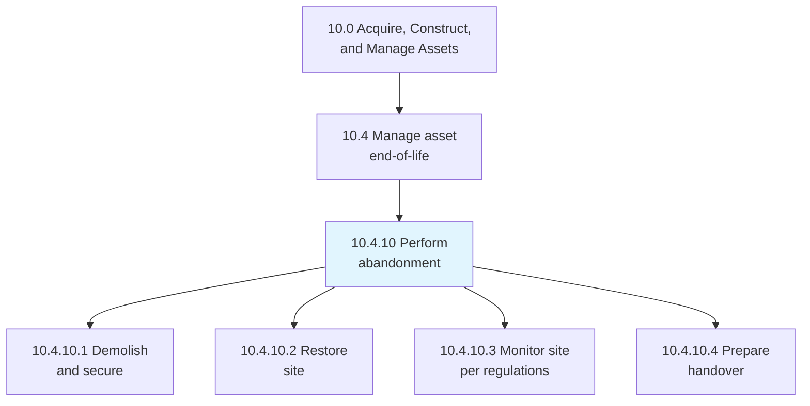
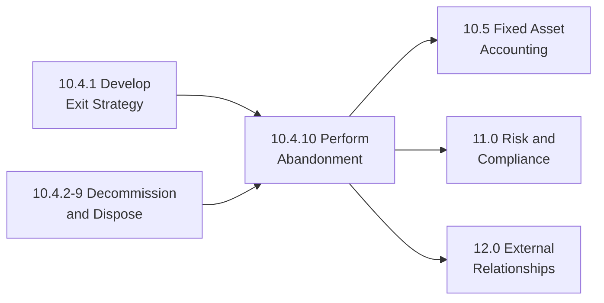

# Perform abandonment

> Planning and performing abandonment activities to safely retire assets while meeting all legal, regulatory, environmental, and social responsibilities.

## Overview

Process 10.4.10 addresses the final stage of asset lifecycle management when assets must be permanently retired and sites restored. This process ensures facilities or equipment are abandoned safely, securely, and in compliance with all applicable regulations.

Abandonment activities are particularly critical in industries with significant environmental obligations such as petroleum, mining, and manufacturing. Proper abandonment protects organizations from ongoing liabilities, ensures environmental stewardship, and maintains community relationships. This process often involves multi-year timelines and substantial financial reserves.

## Process Hierarchy



## Key Statistics

| Metric | Value |
|--------|-------|
| APQC Code | 21582 |
| Hierarchy ID | 10.4.10 |
| Level | Process |
| Parent | [10.4 Manage asset end-of-life](../) |
| Category | [10.0 Acquire, Construct, and Manage Assets](../../) |
| Sub-Processes | 4 |

## Process Flow

```mermaid
flowchart TB
    subgraph Inputs["Inputs"]
        I1["Exit Strategy"]
        I2["Regulatory Requirements"]
        I3["Environmental Assessments"]
        I4["Decommissioning Plan"]
        I5["Financial Reserves"]
        I6["Stakeholder Agreements"]
    end

    subgraph Demolish["10.4.10.1 Demolish and Secure"]
        D1["Remove Equipment"]
        D2["Demolish Structures"]
        D3["Manage Debris"]
        D4["Secure Site"]
    end

    subgraph Restore["10.4.10.2 Restore Site"]
        R1["Environmental Remediation"]
        R2["Soil Restoration"]
        R3["Revegetation"]
        R4["Infrastructure Removal"]
    end

    subgraph Monitor["10.4.10.3 Monitor Site"]
        M1["Environmental Monitoring"]
        M2["Safety Inspections"]
        M3["Regulatory Reporting"]
        M4["Community Communication"]
    end

    subgraph Handover["10.4.10.4 Prepare Handover"]
        H1["Document Transfer"]
        H2["Liability Transfer"]
        H3["Final Certification"]
        H4["Site Handover"]
    end

    subgraph Outputs["Outputs"]
        OUT1["Restored Site"]
        OUT2["Regulatory Sign-Off"]
        OUT3["Monitoring Reports"]
        OUT4["Transfer Documentation"]
    end

    Inputs --> Demolish
    Demolish --> Restore
    Restore --> Monitor
    Monitor --> Handover
    Handover --> Outputs
```



## GraphDL Semantic Structure

```graphdl
perform.Abandonment
```

| Component | Value | Description |
|-----------|-------|-------------|
| Verb | `perform` | Execution action |
| Object | `Abandonment` | Asset retirement activities |

### Decomposed Actions

| Activity | GraphDL Structure |
|----------|-------------------|
| 10.4.10.1 | `demolish.Asset.and.Secure.Site` |
| 10.4.10.2 | `restore.Site` |
| 10.4.10.3 | `monitor.Site.for.RegulatoryDuration` |
| 10.4.10.4 | `prepare.Handover.to.NewOperator` |

## Sub-Processes

### [10.4.10.1 Demolish and secure](./DemolishAndSecure)

Demolishing and securing assets and resulting parts/debris. Ensures safe removal of structures and equipment while managing hazardous materials.

**Key Activities:**
- Remove operational equipment and salvageable materials
- Demolish structures and foundations
- Manage and dispose of debris properly
- Secure site against unauthorized access
- Handle hazardous materials per regulations

### [10.4.10.2 Restore site](./RestoreSite)

Performing remediation or restoration activities to return the site to acceptable environmental conditions.

**Key Activities:**
- Conduct environmental remediation
- Restore soil and groundwater conditions
- Remove subsurface infrastructure
- Revegetate and restore natural habitat
- Document restoration activities

### [10.4.10.3 Monitor site for duration of time required by regulators](./MonitorSiteForDurationOfTimeRequiredByRegulators)

Managing and reporting site status throughout required monitoring periods, which may extend for years or decades.

**Key Activities:**
- Conduct environmental sampling and testing
- Perform safety and security inspections
- Submit regulatory reports and documentation
- Maintain site access and signage
- Communicate with community stakeholders

### [10.4.10.4 Prepare handover to new operator or landowner](./PrepareHandoverToNewOperatorOrLandowner)

Supporting handover to new operator or landowner when monitoring requirements are complete and site meets release criteria.

**Key Activities:**
- Compile complete site documentation
- Obtain regulatory release certifications
- Transfer remaining obligations and warranties
- Execute legal transfer agreements
- Complete final site handover

## RACI Matrix

| Activity | Responsible | Accountable | Consulted | Informed |
|----------|-------------|-------------|-----------|----------|
| Demolish and Secure | Project Manager | VP Operations | Safety, Environmental | Legal, Finance |
| Restore Site | Environmental Team | Environmental Director | Regulators, Community | Executive Team |
| Monitor Site | Environmental Team | Environmental Director | Regulators | Finance, Legal |
| Prepare Handover | Project Manager | VP Operations | Legal, Environmental | Executive Team, Board |

## Key Stakeholders

| Stakeholder | Role | Responsibilities |
|-------------|------|------------------|
| VP of Operations | Executive Owner | Overall abandonment accountability |
| Environmental Director | Compliance Lead | Environmental compliance and restoration |
| Project Manager | Execution Lead | Day-to-day abandonment activities |
| Legal Counsel | Legal Lead | Regulatory compliance, liability management |
| Finance Manager | Financial Lead | Reserve management, cost tracking |
| Community Relations | External Relations | Stakeholder communication |
| Regulatory Agencies | External | Oversight and approval |

## Metrics and KPIs

| Metric | Description | Target |
|--------|-------------|--------|
| Regulatory Compliance | Compliance with all regulatory requirements | 100% |
| Schedule Adherence | Completion vs. planned timeline | Within 10% |
| Budget Variance | Actual vs. estimated abandonment costs | <15% |
| Environmental Targets | Remediation targets achieved | 100% |
| Safety Incidents | Safety events during abandonment | Zero |
| Community Complaints | Stakeholder concerns raised | Zero unresolved |
| Monitoring Compliance | Required monitoring completed on time | 100% |

## Industry Applications

### Petroleum Upstream
Well plugging and abandonment, facility decommissioning, pipeline removal, and site restoration. Multi-decade monitoring often required.

### Mining
Mine closure, tailings management, pit reclamation, and long-term environmental monitoring. Significant financial assurance requirements.

### Manufacturing
Facility demolition, contamination remediation, and brownfield restoration. Environmental liability management critical.

### Utilities
Power plant decommissioning, transmission line removal, and site restoration. Nuclear facilities have extended decommissioning periods.

## Regulatory Considerations

| Regulation Type | Description | Example Requirements |
|-----------------|-------------|---------------------|
| Environmental | Site restoration standards | CERCLA, RCRA cleanup standards |
| Safety | Demolition safety requirements | OSHA demolition standards |
| Financial Assurance | Guarantee of abandonment funds | Surety bonds, trust funds |
| Reporting | Ongoing disclosure obligations | Annual status reports |
| Release Criteria | Conditions for liability release | Regulatory sign-off requirements |

## Related Processes



## Related Departments

- [Environmental Health & Safety](/departments/Operations/Safety) - Compliance and safety
- [Legal](/departments/Legal) - Regulatory and liability management
- [Finance](/departments/Finance) - Financial reserves and accounting
- [Operations](/departments/Operations) - Execution management
- [External Relations](/departments/Marketing) - Community communication

## Related Occupations

- [Environmental Engineers](/occupations/Architecture/EnvironmentalEngineers) - Remediation planning
- [Environmental Scientists](/occupations/Life/EnvironmentalScientists) - Site assessment and monitoring
- [Construction Managers](/occupations/Management/ConstructionManagers) - Demolition management
- [Health and Safety Specialists](/occupations/Health/OccupationalSafetySpecialists) - Safety oversight
- [Lawyers](/occupations/Legal/Lawyers) - Regulatory compliance

## Related Concepts

- AssetRetirement
- SiteRemediation
- EnvironmentalCompliance
- DecommissioningReserves
- RegulatoryRelease
- BrownfieldRestoration

---

*Source: APQC PCF 21582 (10.4.10) - Cross-Industry Process Classification Framework*
