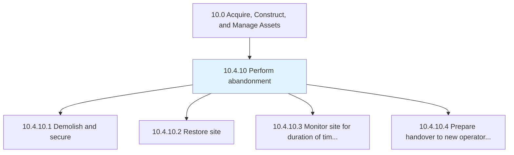
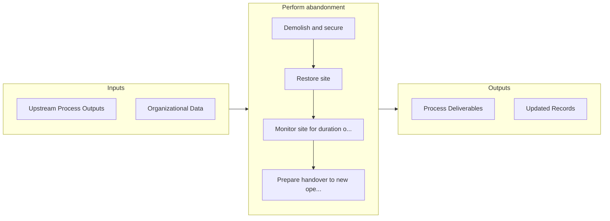

# Perform abandonment

> Planning and performing abandonment activities.

## Overview

Process 10.4.10 is a core process that defines the specific procedures for perform abandonment. 

Planning and performing abandonment activities. Whether facilities or equipment, ensure assets to be abandoned are safe, secure, and meet all legal, regulatory, and social/environmental responsibilities.

## Process Hierarchy



## Key Statistics

| Metric | Value |
|--------|-------|
| APQC Code | 21582 |
| Hierarchy ID | 10.4.10 |
| Level | Process |
| Parent | [10.4](../) |
| Sub-Processes | 4 |


## GraphDL Semantic Structure

```graphdl
perform.Abandonment
```

| Component | Value | Description |
|-----------|-------|-------------|
| Verb | `perform` | Primary action |
| Object | `abandonment` | Direct object |


## Process Flow



## Sub-Processes

| Process | Hierarchy ID | Description |
|---------|-------------|-------------|
| [Demolish and secure](./DemolishAndSecure) | 10.4.10.1 | Demolishing and securing asset and resulting parts/debris |
| [Restore site](./RestoreSite) | 10.4.10.2 | Performing remediation or restoration activities |
| [Monitor site for duration of time required by regulators](./MonitorSiteForDurationOfTimeRequiredByRegulators) | 10.4.10.3 | Managing and reporting site status |
| [Prepare handover to new operator or landowner](./PrepareHandoverToNewOperatorOrLandowner) | 10.4.10.4 | Supporting handover to new operator or landowner |


## Related Concepts

- Abandonment


---

*Source: APQC PCF 21582 (10.4.10) - APQC*
