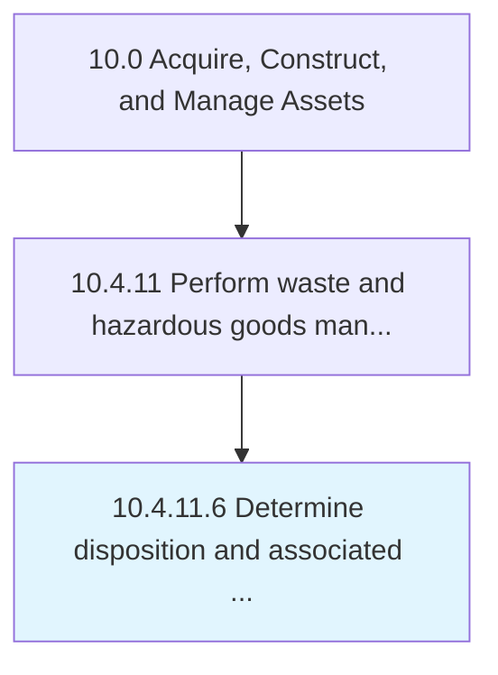

# Determine disposition and associated processing

> Evaluating hazardous materials and waste for appropriate disposition.

## Overview

Activity 10.4.11.6 is an activity within the Acquire, Construct, and Manage Assets framework. 

Evaluating hazardous materials and waste for appropriate disposition. Apply requirements and initiate disposition activities.

## Process Hierarchy



## Key Statistics

| Metric | Value |
|--------|-------|
| APQC Code | 12185 |
| Hierarchy ID | 10.4.11.6 |
| Level | Activity |
| Parent | [10.4.11](../) |
| Sub-Processes | 0 |


## GraphDL Semantic Structure

```
determine.DispositionAndAssociatedProcessing
```

| Component | Value | Description |
|-----------|-------|-------------|
| Verb | `determine` | Primary action |
| Object | `disposition and associated processing` | Direct object |


## Related Concepts

- Disposition
- AssociatedProcessing


---

*Source: APQC PCF 12185 (10.4.11.6) - APQC*
