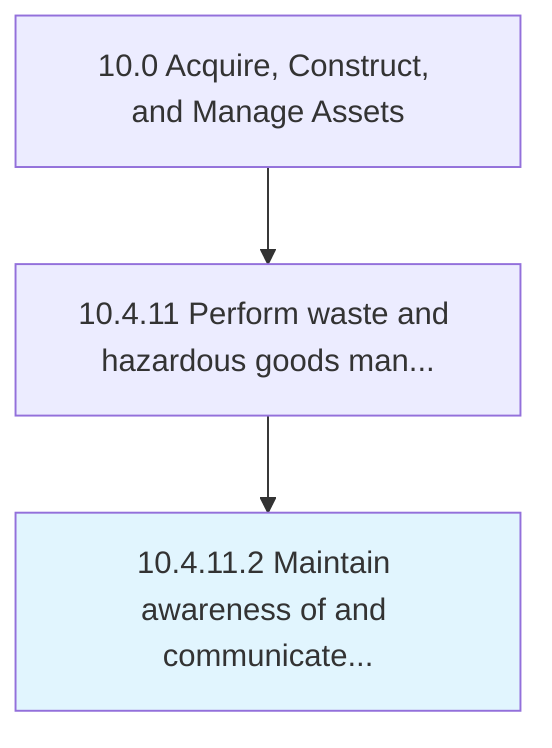

# Maintain awareness of and communicate regulatory requirements

> Understanding and communicating hazardous material regulatory requirements.

## Overview

Activity 10.4.11.2 is an activity within the Acquire, Construct, and Manage Assets framework. 

Understanding and communicating hazardous material regulatory requirements.

## Process Hierarchy



## Key Statistics

| Metric | Value |
|--------|-------|
| APQC Code | 12181 |
| Hierarchy ID | 10.4.11.2 |
| Level | Activity |
| Parent | [10.4.11](../) |
| Sub-Processes | 0 |


## GraphDL Semantic Structure

```
maintain.Awareness.of.AndCommunicateRegulatoryRequirements
```

| Component | Value | Description |
|-----------|-------|-------------|
| Verb | `maintain` | Primary action |
| Object | `awareness` | Direct object |
| Preposition | `of` | Relationship |
| PrepObject | `and communicate regulatory requirements` | Indirect object |


## Related Concepts

- Awareness
- CommunicateRegulatoryRequirements


---

*Source: APQC PCF 12181 (10.4.11.2) - APQC*
