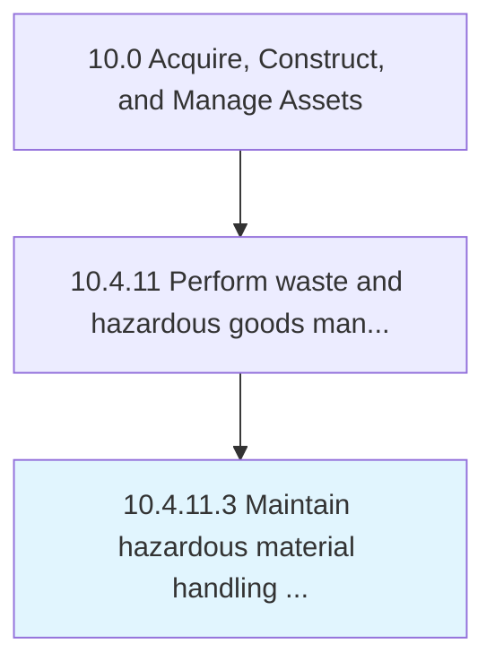

# Maintain hazardous material handling and disposal

> Planning, overseeing, and tracking hazardous material handling and disposal.

## Overview

Activity 10.4.11.3 is an activity within the Acquire, Construct, and Manage Assets framework. 

Planning, overseeing, and tracking hazardous material handling and disposal.

## Process Hierarchy



## Key Statistics

| Metric | Value |
|--------|-------|
| APQC Code | 12182 |
| Hierarchy ID | 10.4.11.3 |
| Level | Activity |
| Parent | [10.4.11](../) |
| Sub-Processes | 0 |


## GraphDL Semantic Structure

```
maintain.HazardousMaterialHandlingAndDisposal
```

| Component | Value | Description |
|-----------|-------|-------------|
| Verb | `maintain` | Primary action |
| Object | `hazardous material handling and disposal` | Direct object |


## Related Concepts

- [HazardousMaterialHandling](/concepts/HazardousMaterialHandling)
- [Disposal](/concepts/Disposal)


---

*Source: APQC PCF 12182 (10.4.11.3) - APQC*
