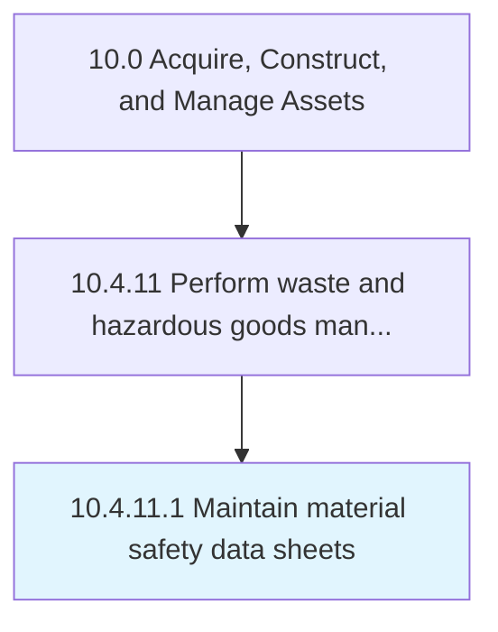

# Maintain material safety data sheets

> Preparing material safety sheets.

## Overview

Activity 10.4.11.1 is an activity within the Acquire, Construct, and Manage Assets framework. 

Preparing material safety sheets. Capture material safety records to properly apply handling and disposal requirements.

## Process Hierarchy



## Key Statistics

| Metric | Value |
|--------|-------|
| APQC Code | 12180 |
| Hierarchy ID | 10.4.11.1 |
| Level | Activity |
| Parent | [10.4.11](../) |
| Sub-Processes | 0 |


## GraphDL Semantic Structure

```
maintain.MaterialSafetyDataSheets
```

| Component | Value | Description |
|-----------|-------|-------------|
| Verb | `maintain` | Primary action |
| Object | `material safety data sheets` | Direct object |


## Related Concepts

- MaterialSafetyDataSheets


---

*Source: APQC PCF 12180 (10.4.11.1) - APQC*
