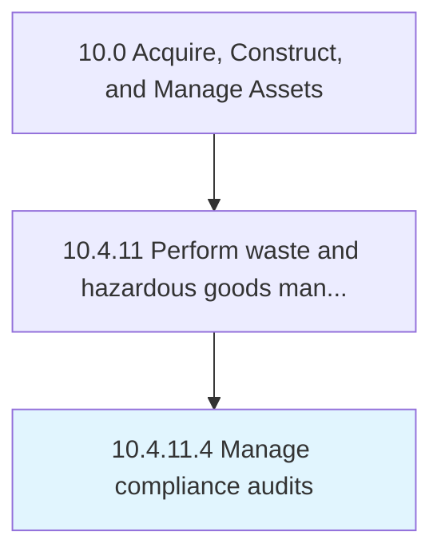

# Manage compliance audits

> Planning, supporting, and documenting hazardous material audits.

## Overview

Activity 10.4.11.4 is an activity within the Acquire, Construct, and Manage Assets framework. 

Planning, supporting, and documenting hazardous material audits.

## Process Hierarchy



## Key Statistics

| Metric | Value |
|--------|-------|
| APQC Code | 12183 |
| Hierarchy ID | 10.4.11.4 |
| Level | Activity |
| Parent | [10.4.11](../) |
| Sub-Processes | 0 |


## GraphDL Semantic Structure

```
manage.ComplianceAudits
```

| Component | Value | Description |
|-----------|-------|-------------|
| Verb | `manage` | Primary action |
| Object | `compliance audits` | Direct object |


## Related Concepts

- ComplianceAudits


---

*Source: APQC PCF 12183 (10.4.11.4) - APQC*
