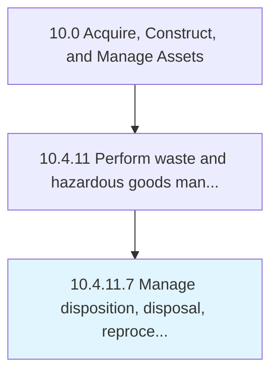

# Manage disposition, disposal, reprocessing activities

> Performing disposition, disposal, and reprocessing activities.

## Overview

Activity 10.4.11.7 is an activity within the Acquire, Construct, and Manage Assets framework. 

Performing disposition, disposal, and reprocessing activities.

## Process Hierarchy



## Key Statistics

| Metric | Value |
|--------|-------|
| APQC Code | 12186 |
| Hierarchy ID | 10.4.11.7 |
| Level | Activity |
| Parent | [10.4.11](../) |
| Sub-Processes | 0 |


## GraphDL Semantic Structure

```
manage.DispositionDisposalReprocessingActivities
```

| Component | Value | Description |
|-----------|-------|-------------|
| Verb | `manage` | Primary action |
| Object | `disposition, disposal, reprocessing activities` | Direct object |


## Related Concepts

- [Disposition](/concepts/Disposition)
- [Disposal](/concepts/Disposal)
- [ReprocessingActivities](/concepts/ReprocessingActivities)


---

*Source: APQC PCF 12186 (10.4.11.7) - APQC*
