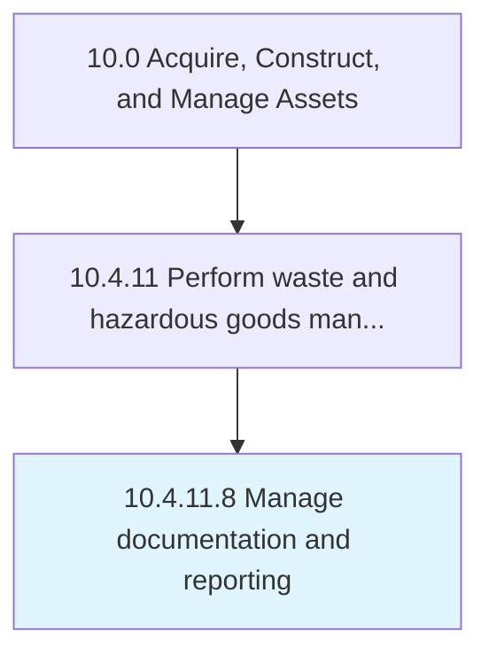

# Manage documentation and reporting

> Documenting and reporting disposition, disposal, and reprocessing activities.

## Overview

Activity 10.4.11.8 is an activity within the Acquire, Construct, and Manage Assets framework. 

Documenting and reporting disposition, disposal, and reprocessing activities.

## Process Hierarchy



## Key Statistics

| Metric | Value |
|--------|-------|
| APQC Code | 12187 |
| Hierarchy ID | 10.4.11.8 |
| Level | Activity |
| Parent | [10.4.11](../) |
| Sub-Processes | 0 |


## GraphDL Semantic Structure

```
manage.DocumentationAndReporting
```

| Component | Value | Description |
|-----------|-------|-------------|
| Verb | `manage` | Primary action |
| Object | `documentation and reporting` | Direct object |


## Related Concepts

- [Documentation](/concepts/Documentation)
- [Reporting](/concepts/Reporting)


---

*Source: APQC PCF 12187 (10.4.11.8) - APQC*
