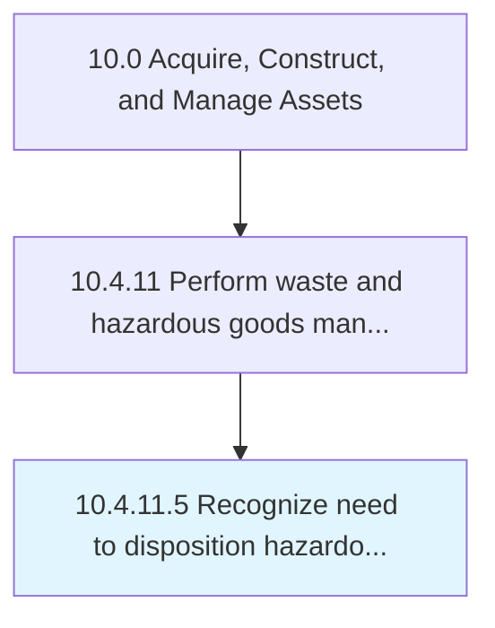

# Recognize need to disposition hazardous materials/waste

> Identifying and establishing approaches to dispose of hazardous materials/waste.

## Overview

Activity 10.4.11.5 is an activity within the Acquire, Construct, and Manage Assets framework. 

Identifying and establishing approaches to dispose of hazardous materials/waste.

## Process Hierarchy



## Key Statistics

| Metric | Value |
|--------|-------|
| APQC Code | 12184 |
| Hierarchy ID | 10.4.11.5 |
| Level | Activity |
| Parent | [10.4.11](../) |
| Sub-Processes | 0 |


## GraphDL Semantic Structure

```
recognize.Need.to.DispositionHazardousMaterialswaste
```

| Component | Value | Description |
|-----------|-------|-------------|
| Verb | `recognize` | Primary action |
| Object | `need` | Direct object |
| Preposition | `to` | Relationship |
| PrepObject | `disposition hazardous materials/waste` | Indirect object |


## Related Concepts

- Need
- DispositionHazardousMaterials
- Need
- DispositionHazardousWaste


---

*Source: APQC PCF 12184 (10.4.11.5) - APQC*
