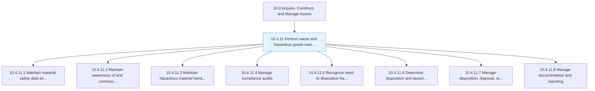
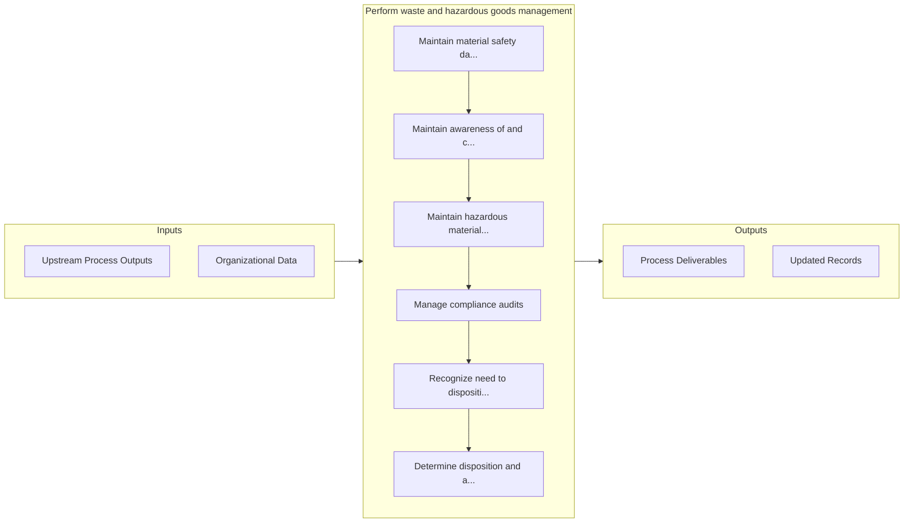

# Perform waste and hazardous goods management

> Planning and performing waste and hazardous goods management.

## Overview

Process 10.4.11 is a core process that defines the specific procedures for perform waste and hazardous goods management. 

Planning and performing waste and hazardous goods management. In compliance with all legal, regulatory, and social/environmental requirements, plan, document, and conduct hazardous material handling, disposal, and reporting.

## Process Hierarchy



## Key Statistics

| Metric | Value |
|--------|-------|
| APQC Code | 21583 |
| Hierarchy ID | 10.4.11 |
| Level | Process |
| Parent | [10.4](../) |
| Sub-Processes | 8 |


## GraphDL Semantic Structure

```
perform.WasteAndHazardousGoodsManagement
```

| Component | Value | Description |
|-----------|-------|-------------|
| Verb | `perform` | Primary action |
| Object | `waste and hazardous goods management` | Direct object |


## Process Flow



## Sub-Processes

| Process | Hierarchy ID | Description |
|---------|-------------|-------------|
| [Maintain material safety data sheets](./MaintainMaterialSafetyDataSheets) | 10.4.11.1 | Preparing material safety sheets |
| [Maintain awareness of and communicate regulatory requirements](./MaintainAwarenessOfAndCommunicateRegulatoryRequirements) | 10.4.11.2 | Understanding and communicating hazardous material regulatory requirements |
| [Maintain hazardous material handling and disposal](./MaintainHazardousMaterialHandlingAndDisposal) | 10.4.11.3 | Planning, overseeing, and tracking hazardous material handling and disposal |
| [Manage compliance audits](./ManageComplianceAudits) | 10.4.11.4 | Planning, supporting, and documenting hazardous material audits |
| [Recognize need to disposition hazardous materials/waste](./RecognizeNeedToDispositionHazardousMaterialswaste) | 10.4.11.5 | Identifying and establishing approaches to dispose of hazardous materials/waste |
| [Determine disposition and associated processing](./DetermineDispositionAndAssociatedProcessing) | 10.4.11.6 | Evaluating hazardous materials and waste for appropriate disposition |
| [Manage disposition, disposal, reprocessing activities](./ManageDispositionDisposalReprocessingActivities) | 10.4.11.7 | Performing disposition, disposal, and reprocessing activities |
| [Manage documentation and reporting](./ManageDocumentationAndReporting) | 10.4.11.8 | Documenting and reporting disposition, disposal, and reprocessing activities |


## Related Concepts

- [WasteGoodsManagement](/concepts/WasteGoodsManagement)
- [HazardousGoodsManagement](/concepts/HazardousGoodsManagement)


---

*Source: APQC PCF 21583 (10.4.11) - APQC*
