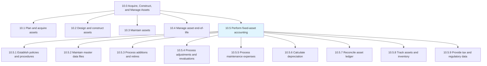
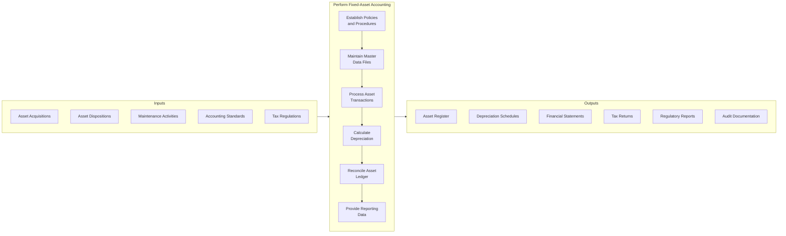
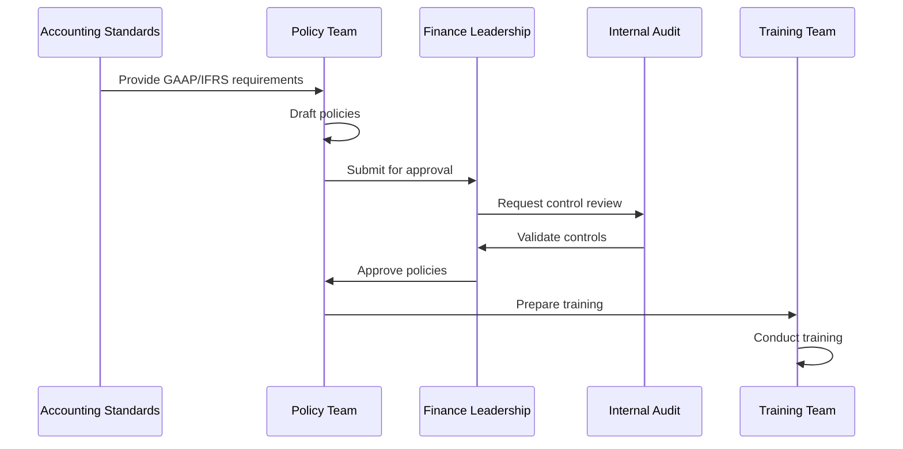
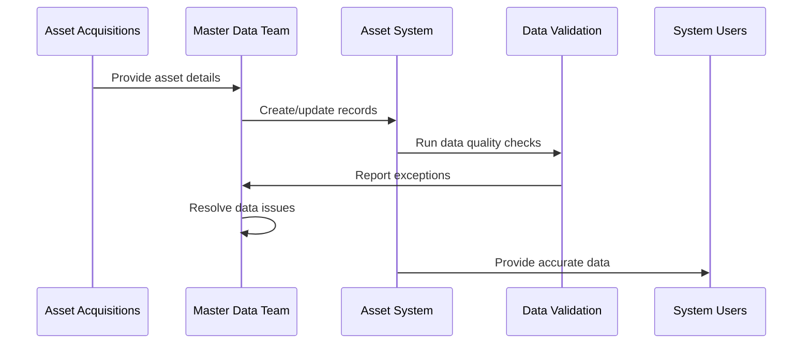
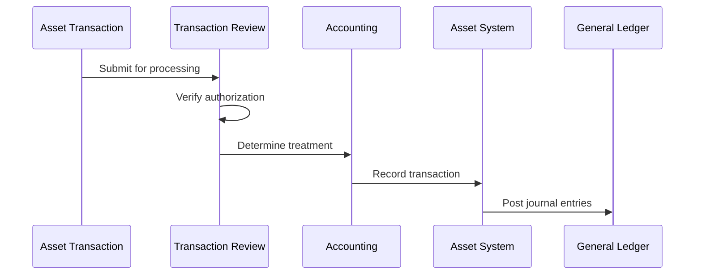
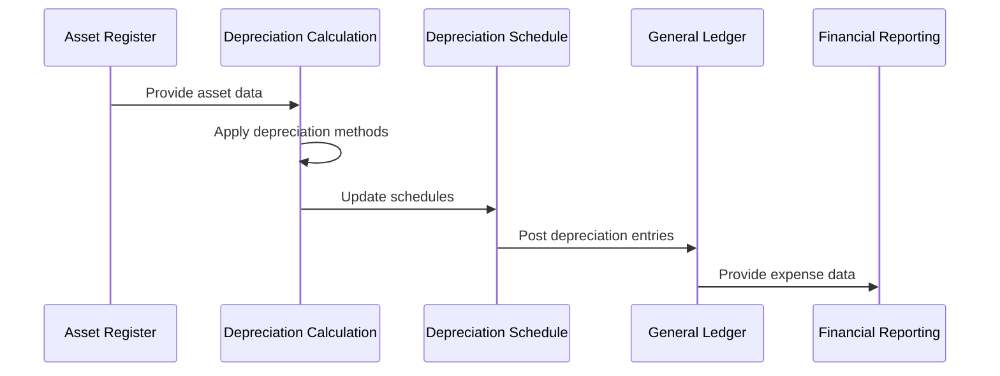
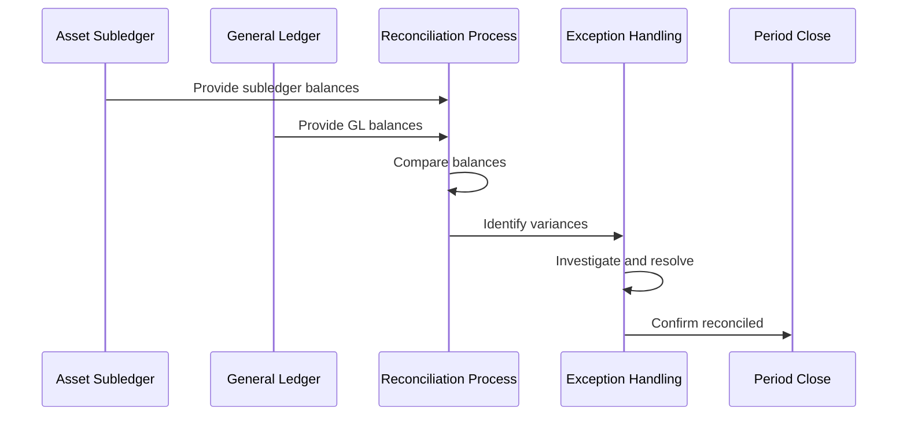
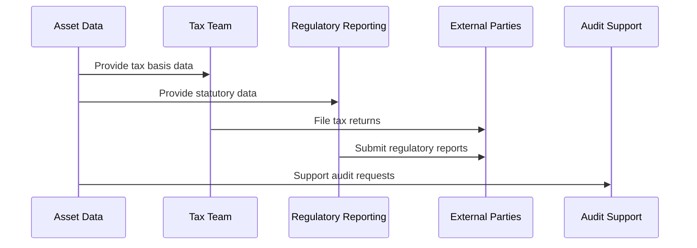
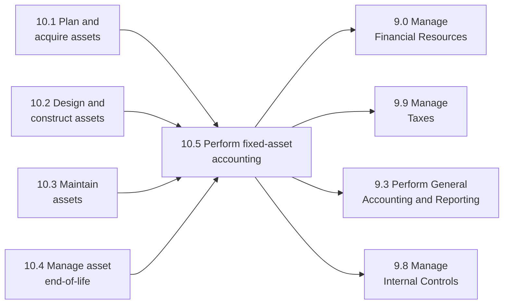

# Perform fixed-asset accounting

> Accounting for long-term and fixed assets. Record purchased, fixed assets that are not easily convertible into cash. Account for costs, useful life, resale value, depreciation, and amortization.

## Overview

Perform fixed-asset accounting is a core process group within the Acquire, Construct, and Manage Assets category (10.0). This process group encompasses all financial accounting activities related to an organization's fixed assets, including policy establishment, master data management, transaction processing, depreciation calculation, and regulatory reporting.

Fixed-asset accounting is essential for accurate financial reporting, tax compliance, and capital investment decision-making. Proper asset accounting ensures that balance sheet values accurately reflect asset positions, income statements appropriately recognize depreciation expense, and management has reliable information for capital planning and investment analysis.

## Process Hierarchy



## Key Statistics

| Metric | Value |
|--------|-------|
| APQC Code | 10749 |
| Hierarchy ID | 10.5 |
| Level | Process Group |
| Category | [Acquire, Construct, and Manage Assets](/processes/10-Assets) |
| Sub-Processes | 9 |
| Related Categories | 9.0 Manage Financial Resources |

## Process Flow



## GraphDL Semantic Structure

```
perform.FixedAssetAccounting
```

| Component | Value | Description |
|-----------|-------|-------------|
| Verb | `perform` | Primary action of executing accounting activities |
| Object | `FixedAssetAccounting` | Financial accounting for long-term assets |
| Preposition | `for` | Relationship to asset types |
| PrepObject | `LongTermAssets` | Assets not easily convertible to cash |

## Activities

### 10.5.1 - Establish Fixed-Asset Policies and Procedures

Creating the governance framework that guides all fixed-asset accounting activities.



**Tasks:**
- `establish.CapitalizationThresholds` - Define monetary limits
- `define.DepreciationMethods` - Select depreciation approaches
- `create.DisposalProcedures` - Document retirement processes
- `publish.PolicyDocumentation` - Communicate organization-wide

### 10.5.2 - Maintain Fixed-Asset Master Data Files

Managing the central repository of all fixed-asset information.



**Tasks:**
- `create.AssetRecords` - Initialize new asset entries
- `maintain.AssetAttributes` - Keep data current
- `validate.DataQuality` - Ensure accuracy
- `archive.HistoricalData` - Retain per policy

### 10.5.3 - Process and Record Asset Transactions

Recording all asset additions, retirements, and modifications.



**Tasks:**
- `process.Acquisitions` - Record new assets
- `process.Dispositions` - Record asset retirements
- `record.Transfers` - Track asset movements
- `post.JournalEntries` - Update general ledger

### 10.5.6 - Calculate and Record Depreciation

Computing periodic depreciation expense for all active assets.



**Tasks:**
- `calculate.BookDepreciation` - Compute GAAP depreciation
- `calculate.TaxDepreciation` - Compute tax basis depreciation
- `post.DepreciationEntries` - Record in general ledger
- `update.AccumulatedDepreciation` - Maintain running totals

### 10.5.7 - Reconcile Fixed-Asset Ledger

Ensuring agreement between asset subledger and general ledger.



**Tasks:**
- `compare.SubledgerToGL` - Match account balances
- `investigate.Variances` - Research discrepancies
- `resolve.Differences` - Correct identified errors
- `document.Reconciliation` - Maintain audit trail

### 10.5.9 - Provide Fixed-Asset Data for Reporting

Supporting tax, statutory, and regulatory reporting requirements.



**Tasks:**
- `prepare.TaxSchedules` - Generate tax depreciation reports
- `compile.RegulatoryReports` - Create required filings
- `support.ExternalAudit` - Respond to auditor requests
- `maintain.ComplianceDocumentation` - Preserve evidence

## RACI Matrix

| Activity | Responsible | Accountable | Consulted | Informed |
|----------|-------------|-------------|-----------|----------|
| Establish policies | Controller | CFO | External auditors | All departments |
| Maintain master data | Asset Team | Asset Manager | IT | Finance |
| Process transactions | Asset Accountant | Controller | Procurement | Department heads |
| Calculate depreciation | Asset Accountant | Controller | Tax | External auditors |
| Reconcile ledger | Accounting Team | Controller | Internal Audit | CFO |
| Provide reporting data | Asset Team | CFO | Tax, Legal | Audit committee |

## Related Departments

- [Finance](/departments/Finance) - Process ownership
- [Accounting](/departments/Accounting) - Transaction processing
- [Tax](/departments/Tax) - Tax compliance
- [Internal Audit](/departments/InternalAudit) - Control assurance
- [Facilities](/departments/Facilities) - Physical asset information
- [IT](/departments/IT) - System support

## Related Occupations

- [Chief Financial Officers](/occupations/CFO) - Overall accountability
- [Financial Managers](/occupations/FinancialManagers) - Process management
- [Accountants and Auditors](/occupations/Accountants) - Transaction execution
- [Tax Preparers](/occupations/TaxPreparers) - Tax compliance
- [Financial Analysts](/occupations/FinancialAnalysts) - Reporting and analysis

## Industry Variations

### Aerospace and Defense

Aerospace fixed-asset accounting addresses government contract cost accounting, specialized equipment with long useful lives, and security classification requirements.

**Industry-Specific Activities:**
- Apply Cost Accounting Standards (CAS)
- Track government-furnished property
- Manage classified asset documentation
- Support DCAA audit requirements

### Automotive

Automotive manufacturing requires detailed tracking of production tooling, flexible manufacturing equipment, and platform-specific assets.

**Industry-Specific Activities:**
- Manage high-volume tooling accounting
- Track platform-specific asset pools
- Handle supplier-owned tooling arrangements
- Process model year changeover retirements

### Banking

Banking fixed-asset accounting focuses on branch network assets, ATM equipment, and technology infrastructure with regulatory capital implications.

**Industry-Specific Activities:**
- Calculate regulatory capital impacts
- Manage branch consolidation accounting
- Track technology refresh cycles
- Report to banking regulators

### Healthcare Provider

Healthcare organizations manage medical equipment with FDA registration, patient safety, and complex reimbursement considerations.

**Industry-Specific Activities:**
- Track FDA-registered devices
- Manage clinical equipment lifecycles
- Support cost-based reimbursement
- Document biomedical maintenance

### Petroleum (Upstream/Downstream)

Oil and gas companies apply specialized accounting methods for exploration, production, and refining assets.

**Industry-Specific Activities:**
- Apply successful efforts or full cost method
- Record asset retirement obligations
- Allocate joint venture asset costs
- Track environmental compliance assets

### Retail

Retail organizations manage distributed store assets, fixture programs, and omnichannel infrastructure.

**Industry-Specific Activities:**
- Standardize fixture accounting
- Manage store remodel programs
- Track POS equipment lifecycle
- Handle seasonal capacity assets

### Utilities

Utility companies maintain long-lived infrastructure with regulatory rate-setting and reliability implications.

**Industry-Specific Activities:**
- Apply regulatory accounting (ASC 980)
- Calculate rate base assets
- Track infrastructure replacement programs
- Report to utility commissions

## Fixed-Asset Accounting Framework

### Depreciation Methods

| Method | Calculation | Best For |
|--------|-------------|----------|
| Straight-Line | (Cost - Salvage) / Useful Life | Assets with even usage |
| Declining Balance | Book Value x Rate | Assets with early-year benefit |
| Units of Production | (Cost - Salvage) x (Units / Total Units) | Assets based on usage |
| Sum-of-Years Digits | (Cost - Salvage) x (Remaining Life / Sum) | Accelerated recognition |

### Key Accounting Standards

| Standard | Description | Applicability |
|----------|-------------|---------------|
| ASC 360 | Property, Plant, and Equipment | US GAAP |
| IAS 16 | Property, Plant, and Equipment | IFRS |
| ASC 842 | Leases | Finance lease accounting |
| ASC 350 | Intangibles | Amortization of intangibles |
| ASC 980 | Regulated Operations | Utility accounting |

### Control Framework

| Control | Description | Frequency |
|---------|-------------|-----------|
| Physical Inventory | Count and verify assets | Annual |
| Subledger Reconciliation | Match to general ledger | Monthly |
| Policy Compliance Review | Audit policy adherence | Quarterly |
| Impairment Assessment | Test for impairment | Annual/Trigger |
| Useful Life Review | Evaluate depreciation assumptions | Annual |

## Sub-Processes

| Process | Code | Description |
|---------|------|-------------|
| [Establish fixed-asset policies and procedures](./AssetPolicies) | 10.5.1 | Governance framework |
| [Maintain fixed-asset master data files](./AssetMasterData) | 10.5.2 | Data management |
| [Process and record fixed-asset additions and retires](./AssetChanges) | 10.5.3 | Transaction processing |
| Process adjustments, enhancements, revaluations | 10.5.4 | Asset modifications |
| Process maintenance and repair expenses | 10.5.5 | Expense vs. capitalize |
| Calculate and record depreciation expense | 10.5.6 | Periodic depreciation |
| Reconcile fixed-asset ledger | 10.5.7 | Account reconciliation |
| Track fixed-assets including physical inventory | 10.5.8 | Physical verification |
| Provide fixed-asset data for tax/regulatory reporting | 10.5.9 | External reporting |

## Related Processes



## Metrics & KPIs

| Metric | Description | Target |
|--------|-------------|--------|
| Asset Record Accuracy | Records matching physical inventory | >99% |
| Depreciation Accuracy | Correct depreciation calculations | >99.9% |
| Reconciliation Timeliness | Days to complete monthly reconciliation | <3 days |
| Transaction Processing Time | Days from event to recording | <5 days |
| Audit Findings | Material asset accounting exceptions | 0 |
| Policy Compliance Rate | Transactions following policy | >98% |
| Close Cycle Contribution | Asset close completed on time | 100% |
| Physical Inventory Variance | Difference from book records | <1% |

---

*Source: APQC PCF 10749 (10.5) - Cross-Industry*
