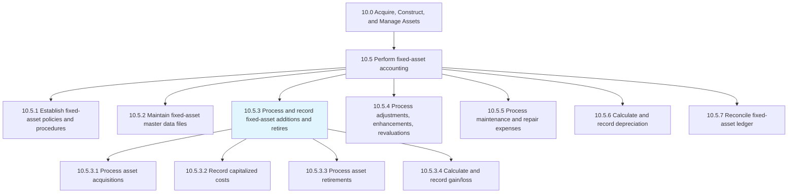
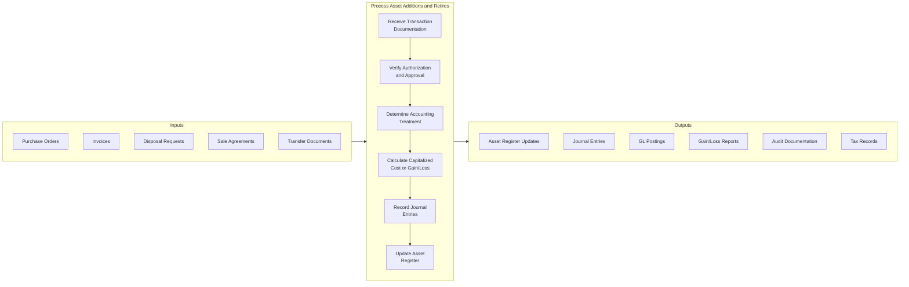
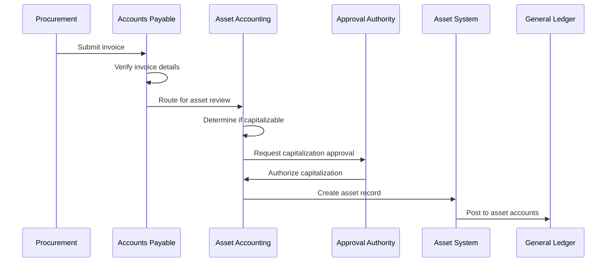
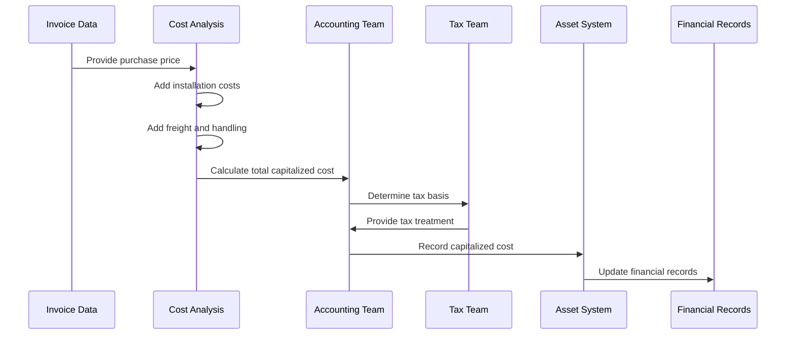
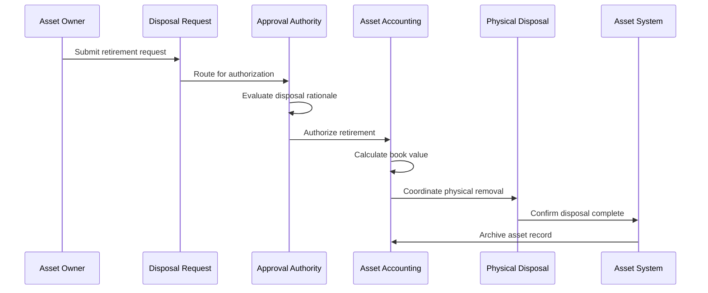
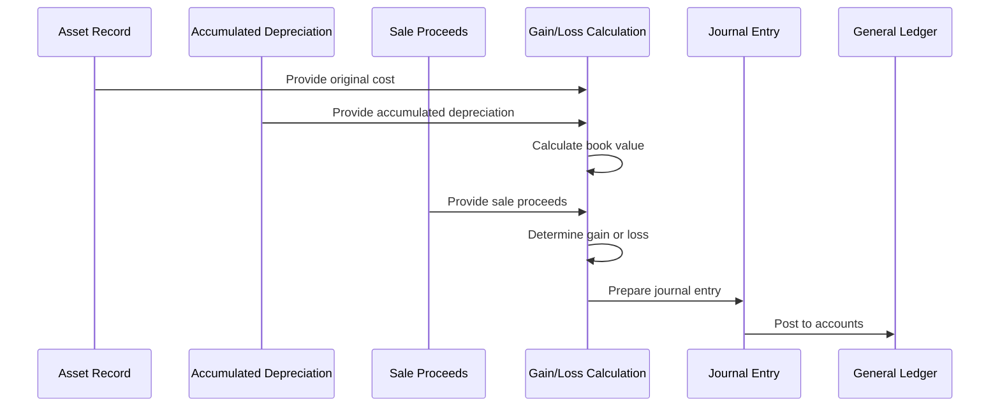
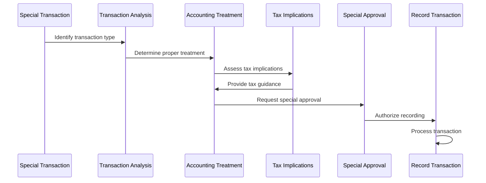
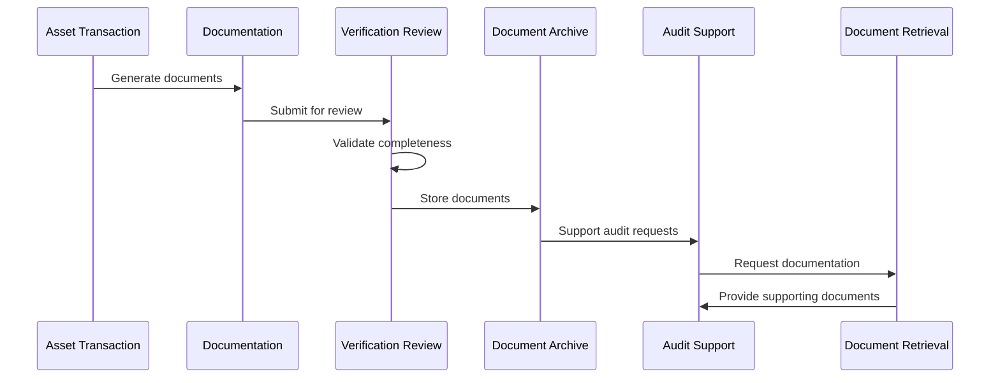
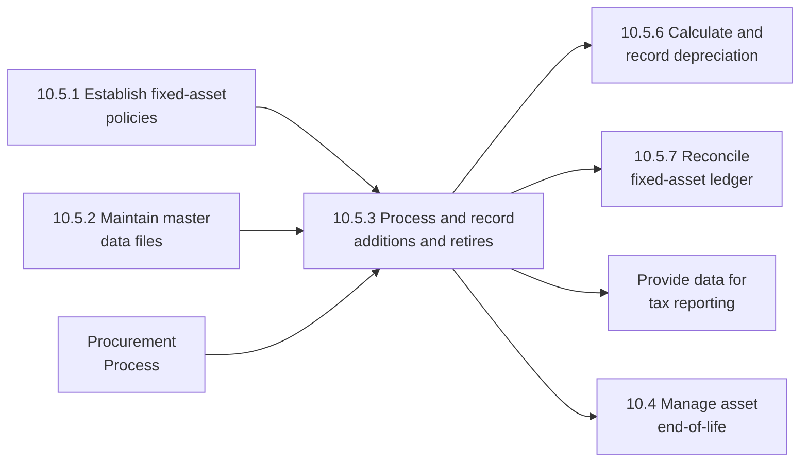

# Process and record fixed-asset additions and retires

> Keeping a summary of sales and purchases of assets. Record any expenses made for new assets purchased and sales of any old assets during the fiscal year.

## Overview

Process and record fixed-asset additions and retires is a fundamental process within the Perform fixed-asset accounting process group (10.5). This process ensures accurate recording of all asset lifecycle events, from initial acquisition through final disposition. Proper processing of additions and retirements is essential for maintaining accurate financial statements, supporting audit requirements, and providing reliable data for capital planning.

Asset additions encompass purchases, construction, capital leases, donations, and transfers from inventory. Asset retirements include sales, disposals, abandonments, trade-ins, and casualty losses. Each transaction type requires specific documentation, authorization, and accounting treatment to ensure compliance with internal policies and external regulations.

## Process Hierarchy



## Key Statistics

| Metric | Value |
|--------|-------|
| APQC Code | 10830 |
| Hierarchy ID | 10.5.3 |
| Level | Process |
| Parent Process | [Perform fixed-asset accounting](/processes/10-Assets/AssetAccounting) |
| Category | [Acquire, Construct, and Manage Assets](/processes/10-Assets) |
| Related Categories | 9.0 Manage Financial Resources |

## Process Flow



## GraphDL Semantic Structure

```
process.FixedAssetAdditionsAndRetires.and.record
```

| Component | Value | Description |
|-----------|-------|-------------|
| Verb | `process` | Primary action of handling transactions |
| Object | `FixedAssetAdditionsAndRetires` | Asset acquisition and disposal transactions |
| Preposition | `and` | Connecting to secondary action |
| PrepObject | `record` | Recording in financial systems |

## Activities

### Process Asset Acquisitions

Handling new asset additions including purchases, constructed assets, leased assets, and received donations.



**Tasks:**
- `receive.AcquisitionDocumentation` - Collect purchase and receiving documents
- `verify.InvoiceDetails` - Validate costs and terms
- `determine.Capitalization` - Apply capitalization criteria
- `obtain.CapitalizationApproval` - Secure authorization

### Calculate and Record Capitalized Costs

Determining the full capitalized cost of assets including purchase price, installation, and other directly attributable costs.



**Tasks:**
- `compile.DirectCosts` - Aggregate purchase price and direct costs
- `allocate.IndirectCosts` - Apportion applicable overhead
- `calculate.TotalCapitalizedCost` - Sum all qualifying costs
- `record.AssetCost` - Enter in asset register

### Process Asset Retirements

Handling asset disposals including sales, scrapping, trade-ins, and casualties.



**Tasks:**
- `receive.RetirementRequest` - Accept disposal request
- `verify.Authorization` - Confirm proper approvals
- `coordinate.PhysicalDisposal` - Manage asset removal
- `update.AssetStatus` - Mark asset as retired

### Calculate and Record Gain/Loss on Disposal

Computing and recording the gain or loss resulting from asset dispositions.



**Tasks:**
- `calculate.BookValue` - Determine net book value at disposal
- `compare.ToProceeds` - Compare to sale or disposal proceeds
- `compute.GainLoss` - Calculate disposal gain or loss
- `record.DisposalEntry` - Post accounting entry

### Handle Special Transactions

Processing non-standard asset transactions including trade-ins, donations, and transfers between entities.



**Tasks:**
- `identify.TransactionType` - Classify special transaction
- `determine.AccountingTreatment` - Apply appropriate standards
- `assess.TaxImplications` - Evaluate tax consequences
- `obtain.SpecialApproval` - Secure authorization for non-standard treatment

### Maintain Documentation and Audit Trail

Ensuring complete documentation for all asset additions and retirements to support audit requirements.



**Tasks:**
- `compile.SupportingDocumentation` - Gather all relevant documents
- `verify.DocumentCompleteness` - Ensure full documentation
- `archive.TransactionRecords` - Store for retention period
- `support.AuditRequests` - Respond to audit inquiries

## RACI Matrix

| Activity | Responsible | Accountable | Consulted | Informed |
|----------|-------------|-------------|-----------|----------|
| Process asset acquisitions | Asset Accountant | Controller | Procurement | Department managers |
| Calculate capitalized costs | Accounting Team | Controller | Tax | Asset owners |
| Process asset retirements | Asset Accountant | Asset Manager | Facilities | Finance |
| Calculate gain/loss | Accounting Team | Controller | Tax | External auditors |
| Handle special transactions | Senior Accountant | CFO | Tax, Legal | Audit committee |
| Maintain documentation | Asset Team | Controller | Internal Audit | External auditors |

## Related Departments

- [Finance](/departments/Finance) - Transaction oversight
- [Accounting](/departments/Accounting) - Record keeping
- [Procurement](/departments/Procurement) - Acquisition processing
- [Facilities](/departments/Facilities) - Physical asset management
- [Tax](/departments/Tax) - Tax treatment guidance
- [Internal Audit](/departments/InternalAudit) - Control validation

## Related Occupations

- [Accountants and Auditors](/occupations/Accountants) - Transaction processing
- [Financial Managers](/occupations/FinancialManagers) - Process oversight
- [Tax Examiners](/occupations/TaxExaminers) - Tax treatment guidance
- [Property Managers](/occupations/PropertyManagers) - Physical asset handling
- [Purchasing Agents](/occupations/PurchasingAgents) - Acquisition documentation

## Industry Variations

### Aerospace and Defense

Aerospace asset transactions often involve government contracts with specific property accountability requirements. Additions may include government-furnished equipment.

**Industry-Specific Considerations:**
- Government property reporting requirements
- Cost accounting standards compliance
- Security classification handling
- Contract close-out asset disposition

### Automotive

Automotive manufacturing frequently involves high-volume tooling transactions and model changeover asset movements.

**Industry-Specific Considerations:**
- Tooling capitalization and amortization
- Model year changeover retirements
- Supplier-owned tooling tracking
- Platform-specific asset grouping

### Banking

Banking institutions process branch and technology asset transactions with regulatory capital implications.

**Industry-Specific Considerations:**
- Regulatory capital impact assessment
- Branch closure mass retirements
- Technology refresh cycles
- Leasehold improvement treatment

### Healthcare Provider

Healthcare organizations manage medical equipment transactions with FDA and patient safety considerations.

**Industry-Specific Considerations:**
- Medical device tracking requirements
- Clinical equipment replacement cycles
- Biomedical certification documentation
- Patient safety compliance verification

### Petroleum (Upstream/Downstream)

Oil and gas companies process exploration, production, and refining asset transactions with unique accounting requirements.

**Industry-Specific Considerations:**
- Successful efforts vs. full cost treatment
- Asset retirement obligation recording
- Joint venture asset allocations
- Environmental remediation provisions

### Retail

Retail organizations process high-volume store asset transactions across distributed locations.

**Industry-Specific Considerations:**
- Multi-location asset tracking
- Store remodel and refresh cycles
- Fixture and equipment standards
- Seasonal capacity adjustments

## Transaction Types Framework

### Asset Additions

| Transaction Type | Description | Documentation Required |
|------------------|-------------|----------------------|
| Purchase | Standard acquisition from vendor | PO, Invoice, Receiving report |
| Construction | Self-constructed or contracted build | Work orders, Cost accumulation |
| Capital Lease | Leased asset meeting capitalization criteria | Lease agreement, Analysis |
| Donation | Asset received as gift | Appraisal, Donor documentation |
| Transfer | Asset received from another entity | Transfer document, Valuation |
| Trade-In | Asset received in exchange | Trade agreement, Fair values |

### Asset Retirements

| Transaction Type | Description | Documentation Required |
|------------------|-------------|----------------------|
| Sale | Asset sold to third party | Sales agreement, Proceeds receipt |
| Scrap | Asset disposed with no recovery | Disposal authorization, Evidence |
| Abandonment | Asset left in place | Abandonment approval, Justification |
| Trade-In | Asset exchanged for new asset | Trade agreement, Fair values |
| Casualty | Asset lost to fire, theft, etc. | Insurance claim, Police report |
| Transfer | Asset moved to another entity | Transfer document, Acceptance |

### Accounting Entries

| Transaction | Debit | Credit |
|-------------|-------|--------|
| Asset Purchase | Fixed Asset, Accumulated Depreciation | Cash/AP |
| Asset Sale (Gain) | Cash, Accumulated Depreciation | Fixed Asset, Gain on Disposal |
| Asset Sale (Loss) | Cash, Accumulated Depreciation, Loss on Disposal | Fixed Asset |
| Asset Scrap | Accumulated Depreciation, Loss on Disposal | Fixed Asset |

## Related Processes



## Sub-Activities

| Activity | Description |
|----------|-------------|
| Receive acquisition documentation | Collect purchase and receiving documents |
| Verify capitalization criteria | Apply threshold and useful life tests |
| Calculate capitalized cost | Determine full acquisition cost |
| Record asset addition | Create asset record and post entry |
| Receive retirement request | Accept disposal authorization |
| Verify disposal authorization | Confirm proper approvals |
| Calculate disposal gain/loss | Compute book value vs. proceeds |
| Record asset retirement | Post disposal entry and update register |
| Process trade-in transactions | Handle exchange transactions |
| Archive transaction documentation | Maintain audit trail |

## Metrics & KPIs

| Metric | Description | Target |
|--------|-------------|--------|
| Transaction Processing Time | Days from receipt to recording | <3 days |
| Documentation Completeness | Transactions with full documentation | 100% |
| Capitalization Accuracy | Correctly classified items | >99% |
| Disposal Authorization Rate | Retirements with proper approval | 100% |
| Gain/Loss Calculation Accuracy | Correct disposal calculations | >99.5% |
| Audit Finding Rate | Exceptions per audit | 0 material |
| Monthly Close Timeliness | Asset subledger closed on time | 100% |

---

*Source: APQC PCF 10830 (10.5.3) - Cross-Industry*
