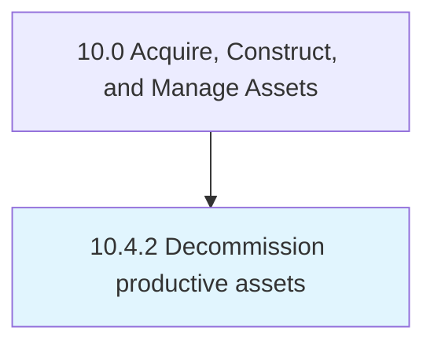

# Decommission productive assets

> Retiring assets that are no longer viable to the business.

## Overview

Process 10.4.2 is a core process that defines the specific procedures for decommission productive assets. 

Retiring assets that are no longer viable to the business. Decommission assets that are no longer in working order, are out of date, or whose maintenance exceeds the cost of replacement.

## Process Hierarchy



## Key Statistics

| Metric | Value |
|--------|-------|
| APQC Code | 19258 |
| Hierarchy ID | 10.4.2 |
| Level | Process |
| Parent | [10.4](../) |
| Sub-Processes | 0 |


## GraphDL Semantic Structure

```
decommission.ProductiveAssets
```

| Component | Value | Description |
|-----------|-------|-------------|
| Verb | `decommission` | Primary action |
| Object | `productive assets` | Direct object |


## Related Concepts

- ProductiveAssets


---

*Source: APQC PCF 19258 (10.4.2) - APQC*
