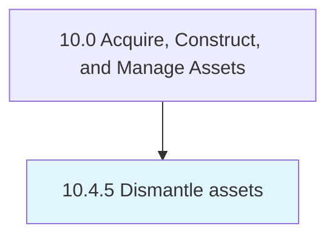

# Dismantle assets

> Dismantling an asset into manageable parts.

## Overview

Process 10.4.5 is a core process that defines the specific procedures for dismantle assets. 

Dismantling an asset into manageable parts. The parts may follow different dispositions, such as resale, reuse, recycle, etc.

## Process Hierarchy



## Key Statistics

| Metric | Value |
|--------|-------|
| APQC Code | 21579 |
| Hierarchy ID | 10.4.5 |
| Level | Process |
| Parent | [10.4](../) |
| Sub-Processes | 0 |


## GraphDL Semantic Structure

```
dismantle.Assets
```

| Component | Value | Description |
|-----------|-------|-------------|
| Verb | `dismantle` | Primary action |
| Object | `assets` | Direct object |


## Related Concepts

- [Assets](/concepts/Assets)


---

*Source: APQC PCF 21579 (10.4.5) - APQC*
