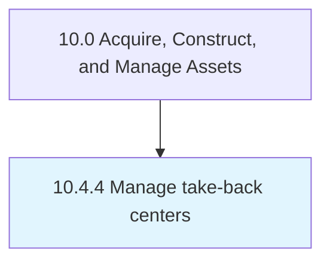

# Manage take-back centers

> Managing locations where end-of-life assets are evaluated for decommissioning, disassembly, recycling, etc.

## Overview

Process 10.4.4 is a core process that defines the specific procedures for manage take-back centers. 

Managing locations where end-of-life assets are evaluated for decommissioning, disassembly, recycling, etc.

## Process Hierarchy



## Key Statistics

| Metric | Value |
|--------|-------|
| APQC Code | 12717 |
| Hierarchy ID | 10.4.4 |
| Level | Process |
| Parent | [10.4](../) |
| Sub-Processes | 0 |


## GraphDL Semantic Structure

```
manage.TakebackCenters
```

| Component | Value | Description |
|-----------|-------|-------------|
| Verb | `manage` | Primary action |
| Object | `take-back centers` | Direct object |


---

*Source: APQC PCF 12717 (10.4.4) - APQC*
