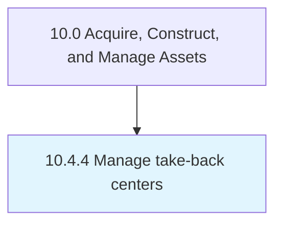

# Manage take-back centers

> Managing locations where end-of-life assets are evaluated for decommissioning, disassembly, recycling, etc.

## Overview

The manage take-back centers process is a critical component of the Asset Management function within an organization. It encompasses the systematic approach to manage take-back centers, ensuring that all activities are performed consistently, efficiently, and in alignment with organizational objectives. This process establishes the framework through which manage take-back centers is executed, monitored, and continuously improved to deliver value across the enterprise.

Within the APQC Process Classification Framework (hierarchy 10.4.4), this process supports the broader "Acquire, Construct, and Manage Assets" category. Effective execution requires cross-functional collaboration, clear accountability, and robust governance mechanisms. Organizations that mature this process typically see improved operational performance, reduced risk exposure, and stronger alignment between tactical activities and strategic goals.


## Process Hierarchy


```mermaid
graph TD
    C10["10.0 Acquire, Construct, and Manage Assets"]
    C10 --> N10_4_4["10.4.4 Manage take-back centers"]
    style N10_4_4 fill:#e1f5fe
```

## Key Statistics

| Metric | Value |
|--------|-------|
| APQC Code | 12717 |
| Hierarchy ID | 10.4.4 |
| Level | Process |
| Parent | [10.4](../) |
| Sub-Processes | 0 |


## GraphDL Semantic Structure

```
manage.TakebackCenters
```

| Component | Value | Description |
|-----------|-------|-------------|
| Verb | `manage` | Primary action |
| Object | `take-back centers` | Direct object |


---

*Source: APQC PCF 12717 (10.4.4) - APQC*
