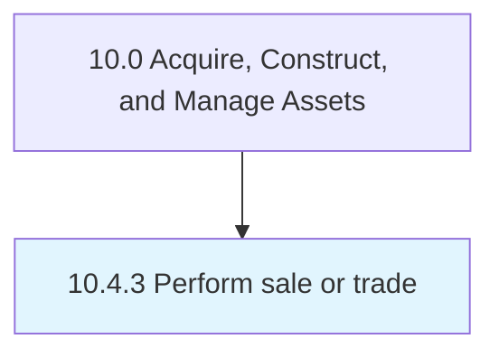

# Perform sale or trade

> Performing the sale of assets.

## Overview

Process 10.4.3 is a core process that defines the specific procedures for perform sale or trade. 

Performing the sale of assets. Achieve and complete the sale process. Deliver the end product to the customers.

## Process Hierarchy



## Key Statistics

| Metric | Value |
|--------|-------|
| APQC Code | 10953 |
| Hierarchy ID | 10.4.3 |
| Level | Process |
| Parent | [10.4](../) |
| Sub-Processes | 0 |


## GraphDL Semantic Structure

```
perform.SaleOrTrade
```

| Component | Value | Description |
|-----------|-------|-------------|
| Verb | `perform` | Primary action |
| Object | `sale or trade` | Direct object |


## Related Concepts

- [Sale](/concepts/Sale)
- [Trade](/concepts/Trade)


---

*Source: APQC PCF 10953 (10.4.3) - APQC*
