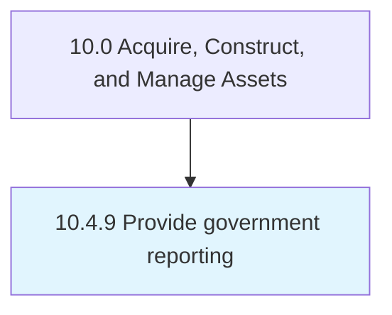

# Provide government reporting

> Preparing and distributing government reports.

## Overview

Process 10.4.9 is a core process that defines the specific procedures for provide government reporting. 

## Process Hierarchy



## Key Statistics

| Metric | Value |
|--------|-------|
| APQC Code | 12722 |
| Hierarchy ID | 10.4.9 |
| Level | Process |
| Parent | [10.4](../) |
| Sub-Processes | 0 |


## GraphDL Semantic Structure

```
provide.GovernmentReporting
```

| Component | Value | Description |
|-----------|-------|-------------|
| Verb | `provide` | Primary action |
| Object | `government reporting` | Direct object |


## Related Concepts

- GovernmentReporting


---

*Source: APQC PCF 12722 (10.4.9) - APQC*
