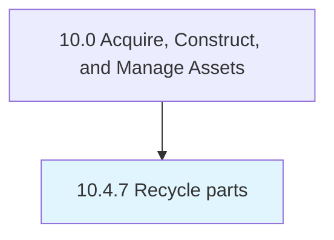

# Recycle parts

> Recycling parts in accordance with legal, regulatory, and social/environmental responsibilities.

## Overview

Process 10.4.7 is a core process that defines the specific procedures for recycle parts. 

Recycling parts in accordance with legal, regulatory, and social/environmental responsibilities.

## Process Hierarchy



## Key Statistics

| Metric | Value |
|--------|-------|
| APQC Code | 21581 |
| Hierarchy ID | 10.4.7 |
| Level | Process |
| Parent | [10.4](../) |
| Sub-Processes | 0 |


## GraphDL Semantic Structure

```
recycle.Parts
```

| Component | Value | Description |
|-----------|-------|-------------|
| Verb | `recycle` | Primary action |
| Object | `parts` | Direct object |


## Related Concepts

- Parts


---

*Source: APQC PCF 21581 (10.4.7) - APQC*
