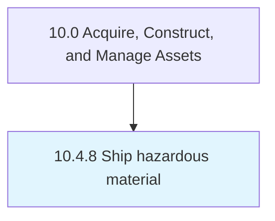

# Ship hazardous material

> Planning, conducting, and tracking shipment of hazardous materials.

## Overview

Process 10.4.8 is a core process that defines the specific procedures for ship hazardous material. 

Planning, conducting, and tracking shipment of hazardous materials.

## Process Hierarchy



## Key Statistics

| Metric | Value |
|--------|-------|
| APQC Code | 12721 |
| Hierarchy ID | 10.4.8 |
| Level | Process |
| Parent | [10.4](../) |
| Sub-Processes | 0 |


## GraphDL Semantic Structure

```
ship.HazardousMaterial
```

| Component | Value | Description |
|-----------|-------|-------------|
| Verb | `ship` | Primary action |
| Object | `hazardous material` | Direct object |


## Related Concepts

- [HazardousMaterial](/concepts/HazardousMaterial)


---

*Source: APQC PCF 12721 (10.4.8) - APQC*
