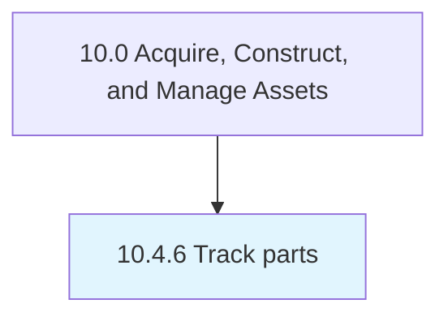

# Track parts

> Tracking the disposition of all parts from end-of-life assets.

## Overview

Process 10.4.6 is a core process that defines the specific procedures for track parts. 

Tracking the disposition of all parts from end-of-life assets. Tracking should provide an audit trail to include source, rational for disposition, and destination.

## Process Hierarchy



## Key Statistics

| Metric | Value |
|--------|-------|
| APQC Code | 21580 |
| Hierarchy ID | 10.4.6 |
| Level | Process |
| Parent | [10.4](../) |
| Sub-Processes | 0 |


## GraphDL Semantic Structure

```
track.Parts
```

| Component | Value | Description |
|-----------|-------|-------------|
| Verb | `track` | Primary action |
| Object | `parts` | Direct object |


## Related Concepts

- [Parts](/concepts/Parts)


---

*Source: APQC PCF 21580 (10.4.6) - APQC*
