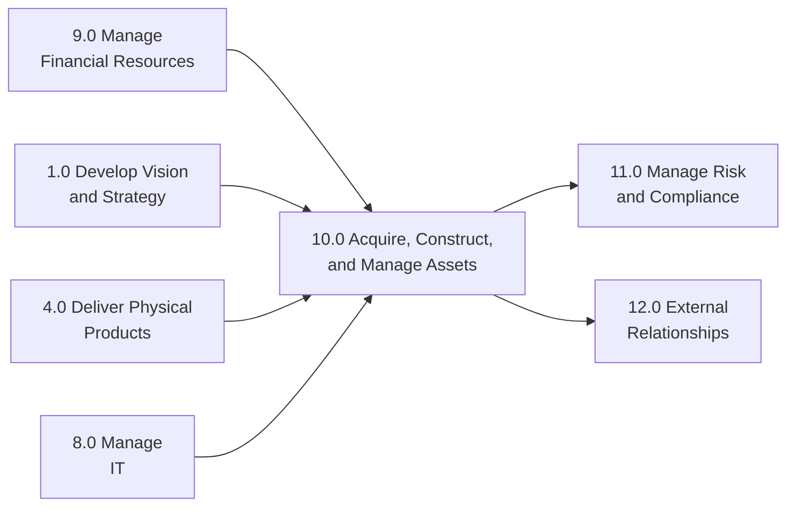

# Acquire, Construct, and Manage Assets

> Relating to the design, construction, acquisition, and management of both productive and non-productive assets. This category encompasses planning and acquiring assets, designing and constructing assets, maintaining assets throughout their lifecycle, and managing asset end-of-life disposition.

## Overview

APQC Category 10.0 - Acquire, Construct, and Manage Assets is a comprehensive process category that covers the complete lifecycle of organizational assets. This includes strategic planning for asset acquisition, capital program management, physical construction or purchase of assets, ongoing maintenance, and eventual disposition or retirement.

Asset management is critical for organizations across all industries, as productive assets (machinery, equipment, facilities) and non-productive assets (office buildings, vehicles) form the foundation upon which business operations depend. Effective asset management maximizes return on investment, minimizes downtime, ensures regulatory compliance, and extends asset useful life.

## Process Hierarchy

```mermaid
graph TD
    C10["10.0 Acquire, Construct, and Manage Assets"] --> G101["10.1 Plan and acquire assets"]
    C10 --> G102["10.2 Design and construct assets"]
    C10 --> G103["10.3 Maintain assets"]
    C10 --> G104["10.4 Manage asset end-of-life"]
    C10 --> G105["10.5 Perform fixed-asset accounting"]

    G101 --> P1011["10.1.1 Develop property strategy"]
    G101 --> P1012["10.1.2 Plan facility"]
    G101 --> P1013["10.1.3 Provide workspace and facilities"]

    G102 --> P1021["10.2.1 Manage capital program"]
    G102 --> P1022["10.2.2 Design and plan construction"]
    G102 --> P1023["10.2.3 Schedule and perform construction"]
    G102 --> P1024["10.2.4 Manage asset construction"]

    G103 --> P1031["10.3.1 Plan asset maintenance"]
    G103 --> P1032["10.3.2 Manage asset maintenance"]
    G103 --> P1033["10.3.3 Perform asset maintenance"]

    G104 --> P1041["10.4.1 Develop exit strategy"]
    G104 --> P1042["10.4.2 Decommission assets"]
    G104 --> P1043["10.4.3 Dismantle and dispose"]

    style C10 fill:#e1f5fe
```

## Key Statistics

| Metric | Value |
|--------|-------|
| APQC Code | 19207 |
| Hierarchy ID | 10.0 |
| Level | Category |
| Process Groups | 5 |
| Total Sub-Processes | 80+ |

## Process Groups

| Process Group | Code | Description |
|---------------|------|-------------|
| Plan and acquire assets | 10.1 | Strategic planning, facility design, workspace acquisition |
| Design and construct assets | 10.2 | Capital programs, construction planning, execution |
| Maintain assets | 10.3 | Preventive, routine, and corrective maintenance |
| Manage asset end-of-life | 10.4 | Decommissioning, disposal, recycling |
| Perform fixed-asset accounting | 10.5 | Asset valuation, depreciation, financial reporting |

## Processes in this Category

### 10.1 Plan and acquire assets

Planning, acquiring, and managing facilities, workspaces, and supporting assets. This includes strategic property planning, facility design, and workspace provisioning.

- [Develop property strategy and long-term vision](./AssetPolicies) - Strategic asset planning
- [Maintain fixed-asset master data files](./AssetMasterData) - Asset information management

### 10.2 Design and construct assets

Designing and constructing assets such as machines, tools, factories, and facilities.

- [Manage asset resource deployment and utilization](./AssetDeployment) - Optimal resource allocation

### 10.3 Maintain assets

Preserving productive assets through planning, managing, and performing maintenance work.

### 10.4 Manage asset end-of-life

Managing the disposition of assets including decommissioning, disassembly, and recycling.

- [Process and record fixed-asset additions and retires](./AssetChanges) - Asset lifecycle transactions

### 10.5 Perform fixed-asset accounting

Accounting for long-term and fixed assets including depreciation and valuation.

- [Perform fixed-asset accounting](./AssetAccounting) - Financial tracking and reporting
- [Establish fixed-asset policies and procedures](./AssetPolicies) - Governance framework

## Related Categories

## Related Departments

- [Facilities Management](/departments/Operations) - Primary ownership
- [Finance](/departments/Finance/index) - Asset accounting
- [Operations](/departments/Operations/index) - Asset utilization
- [Procurement](/departments/Procurement) - Asset acquisition
- [Engineering](/departments/Technology) - Asset design and maintenance

## Related Occupations

- [Facilities Managers](/occupations/Management/FacilitiesManagers)
- [Industrial Engineers](/occupations/Architecture/IndustrialEngineers)
- [Maintenance and Repair Workers](/occupations/MaintenanceWorkers)
- [Financial Managers](/occupations/Management/FinancialManagers)
- [Property Managers](/occupations/PropertyManagers)

---

*Source: APQC PCF Category 10.0 - Cross-Industry*
