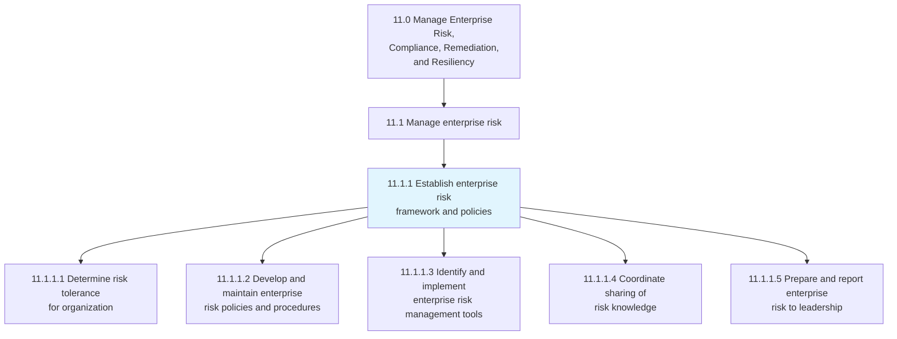
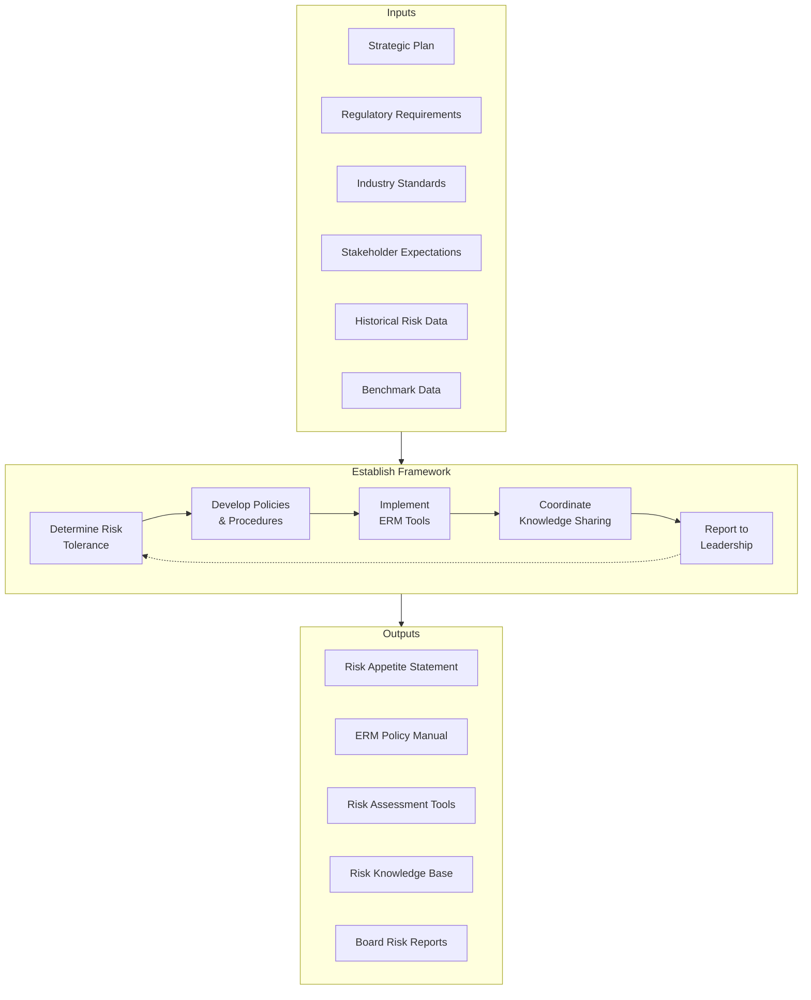
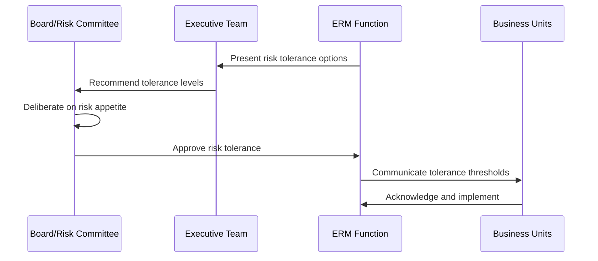
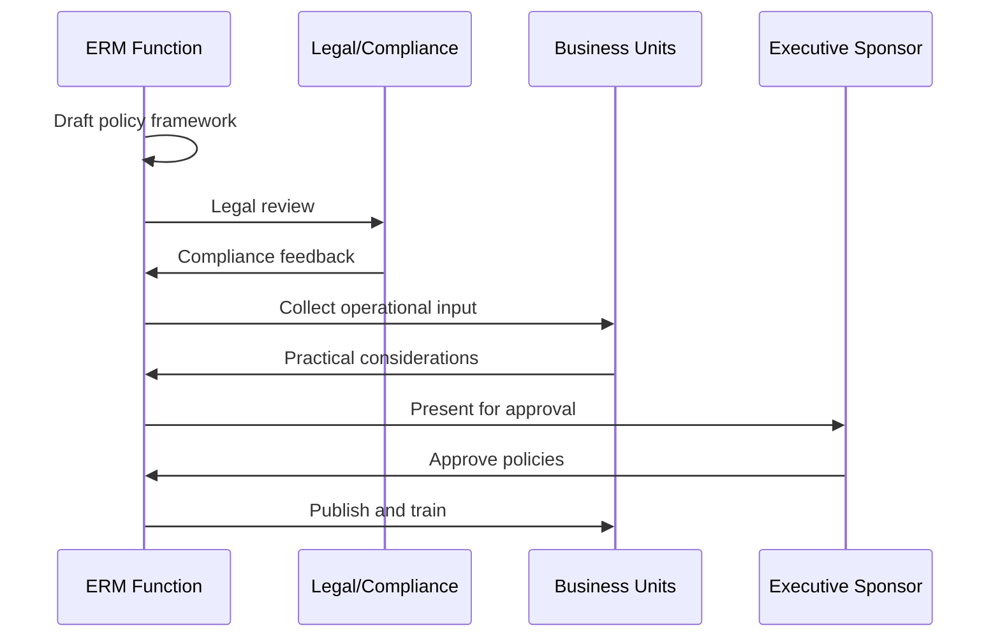
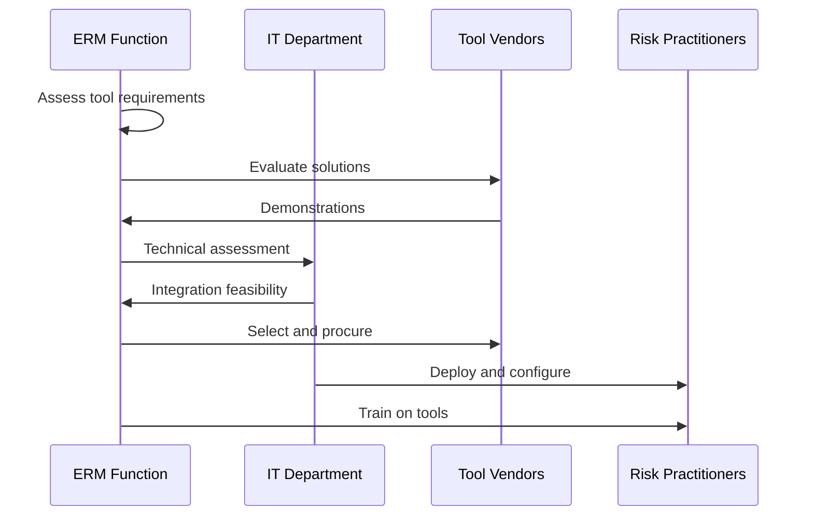
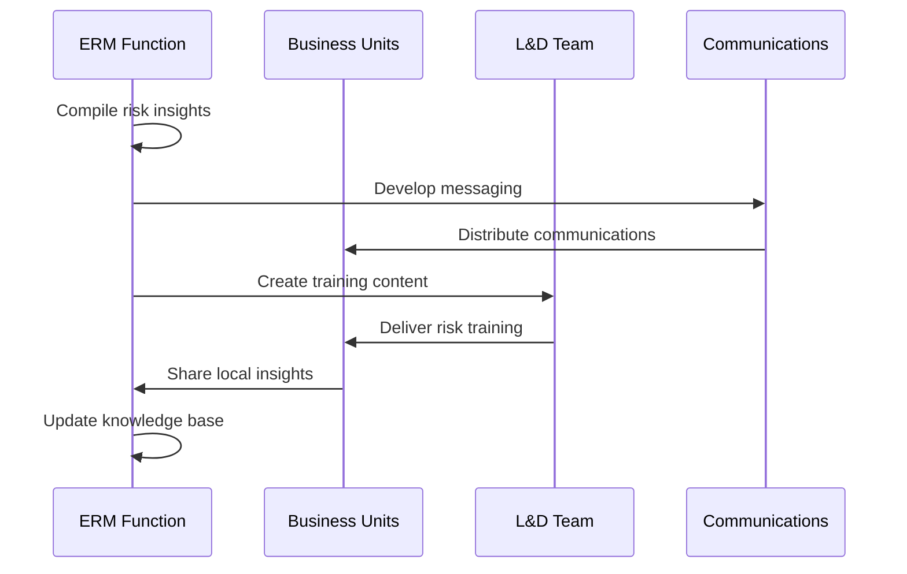
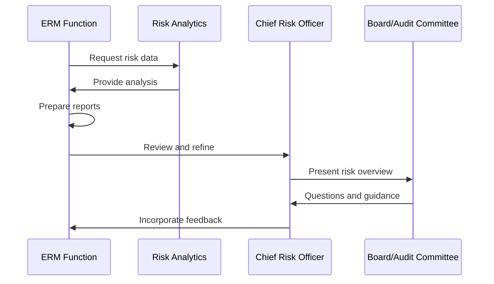
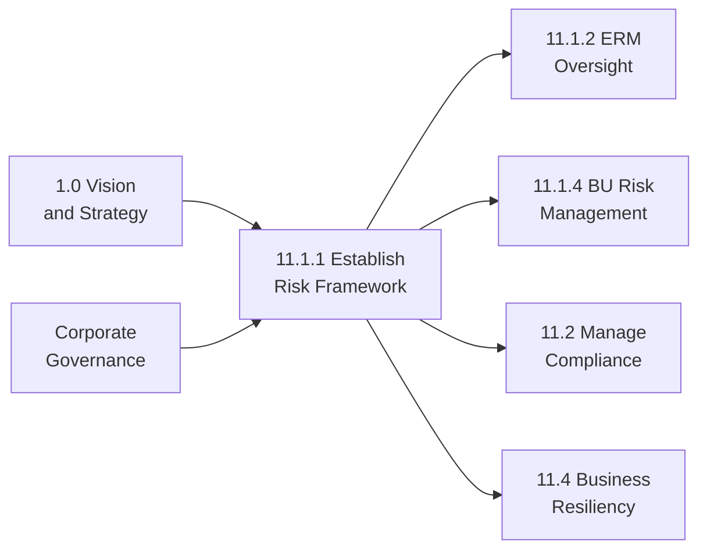

# Establish the enterprise risk framework and policies

> Creating an agenda for the rules and regulations of enterprise risk that deal with hazardous, financial, operational, and strategic risks.

## Overview

Process 11.1.1 establishes the foundational governance structure for enterprise risk management. This process defines the organization's risk tolerance, develops comprehensive policies and procedures, implements tools and methodologies, facilitates knowledge sharing, and ensures appropriate reporting to leadership.

The outputs from this process create the architecture within which all other risk management activities operate. A well-designed framework enables consistent risk identification, assessment, and response across all business units while maintaining flexibility for unit-specific risk profiles.

## Process Hierarchy



## Key Statistics

| Metric | Value |
|--------|-------|
| APQC Code | 16439 |
| Hierarchy ID | 11.1.1 |
| Level | Process |
| Category | [11.0 Manage Enterprise Risk](/processes/11-Risk) |
| Parent | [11.1 Manage enterprise risk](../) |
| Activities | 5 |

## Process Flow



## GraphDL Semantic Structure

```graphdl
establish.EnterpriseRiskFramework.and.Policies
```

| Component | Value | Description |
|-----------|-------|-------------|
| Verb | `establish` | Primary action of creating and formalizing |
| Object | `EnterpriseRiskFramework` | Comprehensive risk governance structure |
| Preposition | `and` | Connector for additional element |
| PrepObject | `Policies` | Formal rules governing risk management |

## Activities

### [11.1.1.1 Determine risk tolerance for organization](./DetermineRiskTolerance.mdx)

Recognizing the organization's tolerance for risk, given risk-return trade-offs for one or more anticipated and predictable consequences.

**APQC Code:** 16440



**Tasks:**
- `assess.StrategicRiskAppetite` - Evaluate strategic risk-taking capacity
- `define.QuantitativeTolerances` - Set numerical risk limits
- `establish.QualitativeGuidelines` - Create risk acceptance criteria
- `align.StakeholderExpectations` - Ensure investor/regulator alignment

### [11.1.1.2 Develop and maintain enterprise risk policies and procedures](./DevelopRiskPolicies.mdx)

Establishing and maintaining the policies and procedures for managing risk. Create rules and regulations for enterprise risk dealing with hazardous, financial, operational, and strategic risks.

**APQC Code:** 16441



**Tasks:**
- `draft.RiskPolicyFramework` - Create comprehensive policy documents
- `define.RiskCategories` - Establish risk taxonomy
- `establish.AssessmentProcedures` - Create risk evaluation methods
- `document.MitigationGuidelines` - Define response strategies

### [11.1.1.3 Identify and implement enterprise risk management tools](./ImplementERMTools.mdx)

Recognizing and implementing tools for managing risk. Identify and apply enterprise risk management tools. Leverage methods and processes to manage risks and opportunities associated with business objectives.

**APQC Code:** 16442



**Tasks:**
- `assess.ToolRequirements` - Identify capability needs
- `evaluate.SoftwareOptions` - Compare GRC platforms
- `implement.RiskSystems` - Deploy selected tools
- `integrate.EnterpriseApplications` - Connect to ERP/BI systems

### [11.1.1.4 Coordinate the sharing of risk knowledge across the organization](./ShareRiskKnowledge.mdx)

Communicating the knowledge about risk within the organization. Identify operational risks. Share risk information within the organization.

**APQC Code:** 16443



**Tasks:**
- `compile.RiskInsights` - Aggregate lessons learned
- `develop.TrainingContent` - Create risk education materials
- `facilitate.KnowledgeExchange` - Enable cross-BU sharing
- `maintain.RiskKnowledgeBase` - Curate risk information repository

### [11.1.1.5 Prepare and report enterprise risk to executive management and board](./ReportEnterpriseRisk.mdx)

Preparing and presenting reports about enterprise risk to the management of the organization. Create reports for management on hazard risks, financial risks, and operational risks.

**APQC Code:** 16444



**Tasks:**
- `aggregate.RiskData` - Compile enterprise risk information
- `analyze.RiskTrends` - Identify patterns and emerging risks
- `prepare.BoardMaterials` - Create executive presentations
- `present.RiskStatus` - Deliver risk updates to leadership

## RACI Matrix

| Activity | Responsible | Accountable | Consulted | Informed |
|----------|-------------|-------------|-----------|----------|
| Determine risk tolerance | ERM Director | CRO | Board, CEO, CFO | All BU Leaders |
| Develop policies | ERM Team | CRO | Legal, Compliance, BUs | All Employees |
| Implement ERM tools | ERM Team | CRO | IT, Procurement | Risk Practitioners |
| Share risk knowledge | ERM Team | CRO | L&D, Communications | All Employees |
| Report to leadership | CRO | CEO | ERM Team, Legal | Board Members |

## Related Departments

- [Enterprise Risk Management](/departments/Operations) - Process owner
- [Legal](/departments/Legal/index) - Policy review and compliance
- [Internal Audit](/departments/Finance) - Framework validation
- [Information Technology](/departments/Technology) - Tool implementation
- [Learning & Development](/departments/HR) - Training delivery

## Related Occupations

- [Chief Risk Officers](/occupations/CRO) - Framework accountability
- [Risk Managers](/occupations/RiskManagers) - Policy development
- [Compliance Officers](/occupations/Business/Operations/ComplianceOfficers) - Regulatory alignment
- [Internal Auditors](/occupations/InternalAuditors) - Framework assessment
- [IT Project Managers](/occupations/ITProjectManagers) - Tool implementation

## Industry Variations

### Banking

Banking risk frameworks must address Basel III/IV requirements, including capital adequacy, liquidity coverage, and net stable funding ratios. The framework integrates with regulatory stress testing programs.

**Industry-Specific Activities:**
- Develop risk-weighted asset methodology
- Establish internal capital adequacy assessment
- Create liquidity risk framework
- Implement model risk governance

### Aerospace and Defense

Defense contractors establish frameworks addressing program-specific risks, cost-plus contract requirements, and DFARS compliance.

**Industry-Specific Activities:**
- Define program risk frameworks
- Establish earned value risk integration
- Create technology readiness risk criteria
- Develop supply chain risk policies

### Healthcare Provider

Healthcare frameworks balance clinical, operational, and financial risks within HIPAA and patient safety requirements.

**Industry-Specific Activities:**
- Establish clinical risk framework
- Create patient safety governance
- Develop privacy risk policies
- Define revenue integrity controls

## Sub-Processes

| Activity | Code | Description |
|----------|------|-------------|
| [Determine risk tolerance](./DetermineRiskTolerance.mdx) | 11.1.1.1 | Define organizational risk appetite |
| [Develop policies](./DevelopRiskPolicies.mdx) | 11.1.1.2 | Create risk management rules |
| [Implement tools](./ImplementERMTools.mdx) | 11.1.1.3 | Deploy GRC systems |
| [Share knowledge](./ShareRiskKnowledge.mdx) | 11.1.1.4 | Facilitate risk learning |
| [Report to leadership](./ReportEnterpriseRisk.mdx) | 11.1.1.5 | Executive risk communication |

## Related Processes



## Metrics & KPIs

| Metric | Description | Target |
|--------|-------------|--------|
| Policy Coverage | Risk categories with approved policies | 100% |
| Framework Maturity | RIMS RMM or similar assessment score | Level 4+ |
| Tool Adoption | Users actively using GRC platform | >90% |
| Training Completion | Employees completing risk training | >95% |
| Board Reporting | Quarters with risk presentation | 4/4 |
| Policy Currency | Policies reviewed within 12 months | 100% |

---

*Source: APQC PCF 16439 (11.1.1) - Cross-Industry Process Classification Framework*
