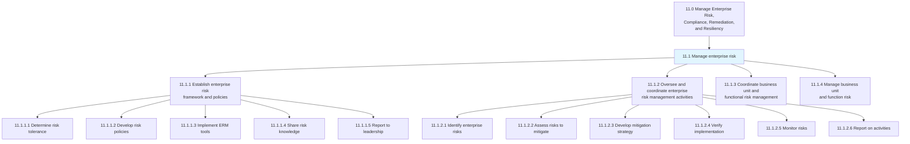
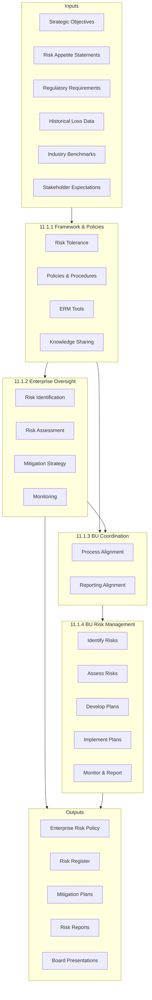
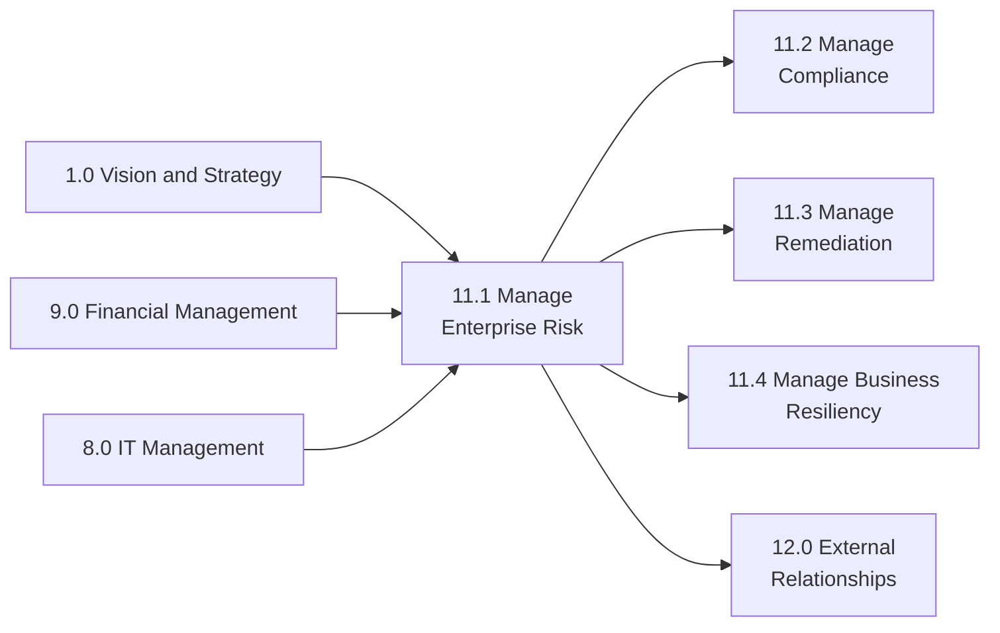

# Manage enterprise risk

> Creating requisite frameworks and coordinating all risk management activities for the entire organization and each function. Manage the enterprise risk by outlining the risk policies and procedures. Monitor and communicate all risk management activities. Encourage correspondence among the business units. Manage the risk of all business units and functions.

## Overview

Process Group 11.1 represents the core enterprise risk management (ERM) function that establishes governance structures, coordinates risk activities across the organization, and ensures consistent risk management practices at all levels. This process group encompasses framework development, enterprise-wide risk oversight, cross-functional coordination, and business unit-level risk management.

Effective enterprise risk management integrates risk considerations into strategic planning, capital allocation, and operational decisions. The processes in this group create a unified approach to identifying, assessing, mitigating, and monitoring risks across all categories including strategic, operational, financial, and compliance risks.

## Process Hierarchy



## Key Statistics

| Metric | Value |
|--------|-------|
| APQC Code | 17060 |
| Hierarchy ID | 11.1 |
| Level | Process Group |
| Category | [11.0 Manage Enterprise Risk](/processes/11-Risk) |
| Child Processes | 4 |
| Total Activities | 22 |

## Process Flow



## GraphDL Semantic Structure

```graphdl
manage.EnterpriseRisk
```

| Component | Value | Description |
|-----------|-------|-------------|
| Verb | `manage` | Primary action of overseeing and controlling |
| Object | `EnterpriseRisk` | Organization-wide risk exposure |
| Preposition | - | Not applicable at process group level |
| PrepObject | - | Not applicable at process group level |

### Decomposed Actions

| Process | GraphDL Structure |
|---------|-------------------|
| 11.1.1 | `establish.EnterpriseRiskFramework.and.Policies` |
| 11.1.2 | `oversee.EnterpriseRiskManagementActivities` |
| 11.1.3 | `coordinate.BusinessUnitRiskManagement` |
| 11.1.4 | `manage.BusinessUnitRisk` |

## Child Processes

### [11.1.1 Establish the enterprise risk framework and policies](./11.1.1-RiskFramework/)

Creating an agenda for the rules and regulations of enterprise risk that deal with hazardous, financial, operational, and strategic risks.

**APQC Code:** 16439 | **Activities:** 5

### [11.1.2 Oversee and coordinate enterprise risk management activities](./11.1.2-RiskOversight/)

Coordinating to plan, organize, lead, and control the activities of an organization in order to minimize the effects of risk on capital and earnings.

**APQC Code:** 16445 | **Activities:** 6

### [11.1.3 Coordinate business unit and functional risk management activities](./11.1.3-BusinessUnitCoordination/)

Coordinating risk management activities across business units to improve opportunities and lessen threats.

**APQC Code:** 16452 | **Activities:** 2

### [11.1.4 Manage business unit and function risk](./11.1.4-BusinessUnitRisk/)

Analyzing the threats a business unit/function faces to prioritize the controls it implements.

**APQC Code:** 17462 | **Activities:** 8

## RACI Matrix

| Process | Responsible | Accountable | Consulted | Informed |
|---------|-------------|-------------|-----------|----------|
| 11.1.1 Establish framework | ERM Team | CRO | Legal, Finance, Strategy | Board, All BUs |
| 11.1.2 Oversee ERM activities | ERM Team | CRO | All Functions | Executive Team |
| 11.1.3 Coordinate BU risk | ERM Team | CRO | BU Risk Managers | All BUs |
| 11.1.4 Manage BU risk | BU Risk Managers | BU Leaders | ERM, Legal | CRO, Board |

## Industry Variations

### Banking

Banks implement enterprise risk management within a comprehensive three lines of defense model. ERM functions address credit, market, operational, and liquidity risks with sophisticated quantitative frameworks aligned to Basel requirements.

**Industry-Specific Focus:**
- Risk-weighted asset optimization
- Stress testing and scenario analysis
- Model risk management
- Conduct risk oversight

### Aerospace and Defense

Extended program lifecycles require multi-decade risk planning horizons. ERM addresses program execution risks, supply chain dependencies, and compliance with government contracting requirements.

**Industry-Specific Focus:**
- Program risk management
- Supply chain risk assessment
- Technology obsolescence risk
- Contract compliance risk

### Healthcare Provider

Healthcare ERM balances clinical quality risks, patient safety, operational efficiency, and financial sustainability within a complex regulatory environment.

**Industry-Specific Focus:**
- Clinical quality and safety risks
- Revenue cycle risks
- Regulatory compliance risks
- Cybersecurity and privacy risks

### Property and Casualty Insurance

Insurance ERM is foundational to business operations, addressing underwriting, claims, investment, and catastrophe risks with sophisticated actuarial and capital modeling.

**Industry-Specific Focus:**
- Underwriting risk management
- Catastrophe risk modeling
- Reserve adequacy
- Investment risk governance

### Utilities

Utility ERM addresses operational reliability, safety, environmental compliance, and regulatory recovery of prudent costs within a highly regulated environment.

**Industry-Specific Focus:**
- Grid reliability risks
- Cybersecurity threats
- Environmental compliance
- Rate recovery risks

## Related Occupations

- [Chief Risk Officers](/occupations/CRO) - Enterprise risk leadership
- [Risk Managers](/occupations/RiskManagers) - Day-to-day risk management
- [Internal Auditors](/occupations/InternalAuditors) - Independent risk assurance
- [Compliance Officers](/occupations/Business/Operations/ComplianceOfficers) - Regulatory risk oversight
- [Actuaries](/occupations/Technology/Actuaries) - Quantitative risk analysis

## Related Processes



## Metrics & KPIs

| Metric | Description | Target |
|--------|-------------|--------|
| Risk Coverage | Percentage of enterprise risks identified | >95% |
| Mitigation Effectiveness | Risks with approved mitigation plans | >90% |
| Policy Compliance | BUs complying with ERM policy | 100% |
| Reporting Timeliness | Risk reports delivered on schedule | 100% |
| Board Engagement | Risk presentations to Board per year | 4+ |
| Incident Response | Time to escalate material risks | <24 hours |

---

*Source: APQC PCF 17060 (11.1) - Cross-Industry Process Classification Framework*
