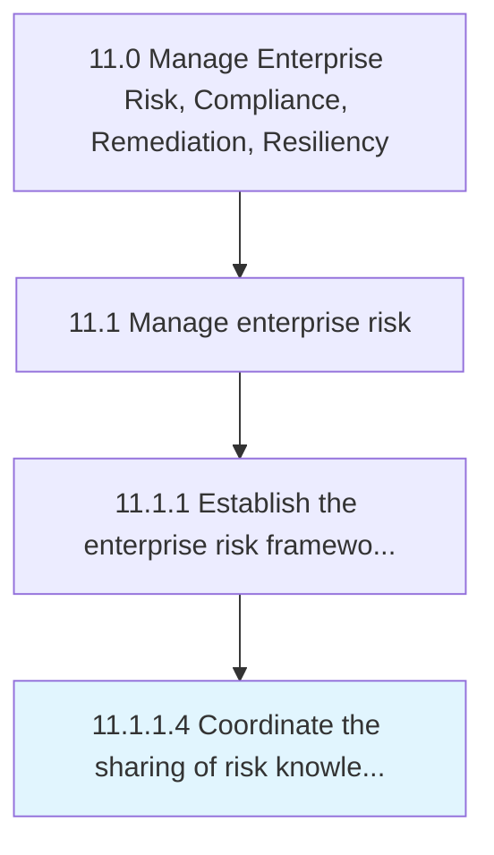

# Coordinate the sharing of risk knowledge across the organization

> Communicating the knowledge about risk within the organization.

## Overview

Activity 11.1.1.4 is an activity within the Manage Enterprise Risk, Compliance, Remediation, Resiliency framework. 

Communicating the knowledge about risk within the organization. Identify operational risks. Share risk information within the organization.

## Process Hierarchy



## Key Statistics

| Metric | Value |
|--------|-------|
| APQC Code | 16443 |
| Hierarchy ID | 11.1.1.4 |
| Level | Activity |
| Parent | [11.1.1](../) |
| Sub-Processes | 0 |


## GraphDL Semantic Structure

```
coordinate.TheSharing.of.RiskKnowledgeAcrossTheOrganization
```

| Component | Value | Description |
|-----------|-------|-------------|
| Verb | `coordinate` | Primary action |
| Object | `the sharing` | Direct object |
| Preposition | `of` | Relationship |
| PrepObject | `risk knowledge across the organization` | Indirect object |


## Related Concepts

- Sharing
- RiskKnowledgeAcrossOrganization


---

*Source: APQC PCF 16443 (11.1.1.4) - APQC*
