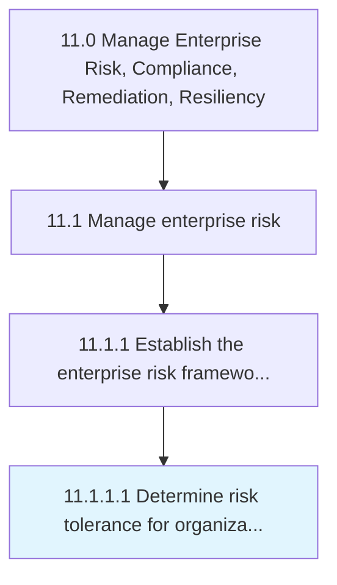

# Determine risk tolerance for organization

> Recognizing the organization's tolerance for risk, given risk-return trade-offs for one or more anticipated and predictable consequences.

## Overview

Activity 11.1.1.1 is an activity within the Manage Enterprise Risk, Compliance, Remediation, Resiliency framework. 

Recognizing the organization's tolerance for risk, given risk-return trade-offs for one or more anticipated and predictable consequences.

## Process Hierarchy



## Key Statistics

| Metric | Value |
|--------|-------|
| APQC Code | 16440 |
| Hierarchy ID | 11.1.1.1 |
| Level | Activity |
| Parent | [11.1.1](../) |
| Sub-Processes | 0 |


## GraphDL Semantic Structure

```
determine.RiskTolerance.for.Organization
```

| Component | Value | Description |
|-----------|-------|-------------|
| Verb | `determine` | Primary action |
| Object | `risk tolerance` | Direct object |
| Preposition | `for` | Relationship |
| PrepObject | `organization` | Indirect object |


## Related Concepts

- [RiskTolerance](/concepts/RiskTolerance)
- [Organization](/concepts/Organization)


---

*Source: APQC PCF 16440 (11.1.1.1) - APQC*
