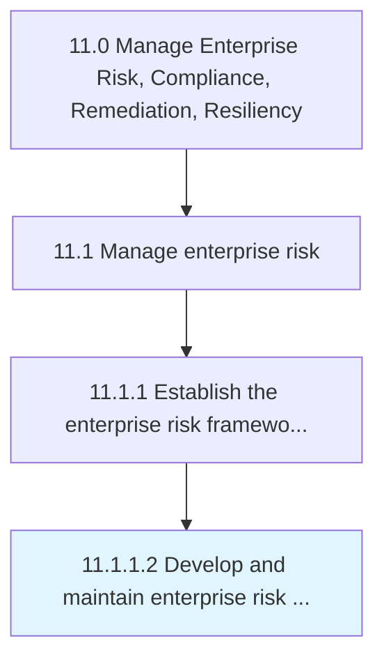

# Develop and maintain enterprise risk policies and procedures

> Establishing and maintaining the policies and procedures for managing risk.

## Overview

Activity 11.1.1.2 is an activity within the Manage Enterprise Risk, Compliance, Remediation, Resiliency framework. 

Establishing and maintaining the policies and procedures for managing risk. Create rules and regulations for enterprise risk dealing with hazardous, financial, operational, and strategic risks.

## Process Hierarchy



## Key Statistics

| Metric | Value |
|--------|-------|
| APQC Code | 16441 |
| Hierarchy ID | 11.1.1.2 |
| Level | Activity |
| Parent | [11.1.1](../) |
| Sub-Processes | 0 |


## GraphDL Semantic Structure

```
develop.AndMaintainEnterpriseRiskPoliciesAndProcedures
```

| Component | Value | Description |
|-----------|-------|-------------|
| Verb | `develop` | Primary action |
| Object | `and maintain enterprise risk policies and procedures` | Direct object |


## Related Concepts

- EnterpriseRiskPolicies
- Procedures
- EnterpriseRiskPolicies
- Procedures


---

*Source: APQC PCF 16441 (11.1.1.2) - APQC*
