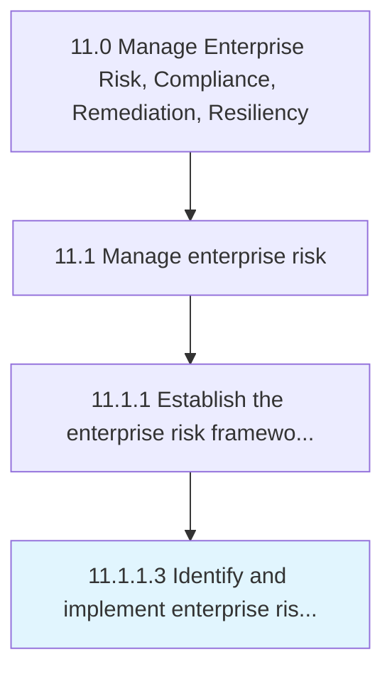

# Identify and implement enterprise risk management tools

> Recognizing and implementing tools for managing risk.

## Overview

Activity 11.1.1.3 is an activity within the Manage Enterprise Risk, Compliance, Remediation, Resiliency framework. 

Recognizing and implementing tools for managing risk. Identify and apply enterprise risk management tools. Leverage methods and processes to manage risks and opportunities associated with business objectives.

## Process Hierarchy



## Key Statistics

| Metric | Value |
|--------|-------|
| APQC Code | 16442 |
| Hierarchy ID | 11.1.1.3 |
| Level | Activity |
| Parent | [11.1.1](../) |
| Sub-Processes | 0 |


## GraphDL Semantic Structure

```
identify.AndImplementEnterpriseRiskManagementTools
```

| Component | Value | Description |
|-----------|-------|-------------|
| Verb | `identify` | Primary action |
| Object | `and implement enterprise risk management tools` | Direct object |


## Related Concepts

- [EnterpriseRiskManagementTools](/concepts/EnterpriseRiskManagementTools)
- [EnterpriseRiskManagementTools](/concepts/EnterpriseRiskManagementTools)


---

*Source: APQC PCF 16442 (11.1.1.3) - APQC*
