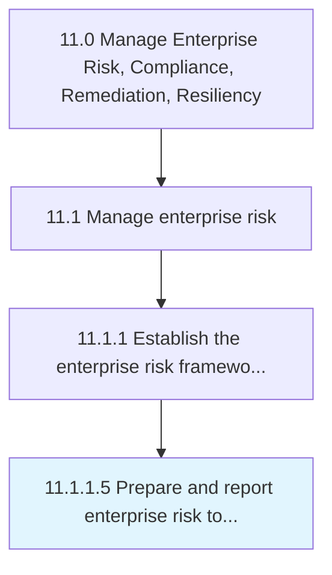

# Prepare and report enterprise risk to executive management and board

> Preparing and presenting reports about enterprise risk to the management of the organization.

## Overview

Activity 11.1.1.5 is an activity within the Manage Enterprise Risk, Compliance, Remediation, Resiliency framework. 

Preparing and presenting reports about enterprise risk to the management of the organization. Create reports for management on hazard risks (e.g., property damage and liability torts), financial risks (e.g., currency and liquidity risks), and operational risks (e.g., product failure, customer satisfaction, social trends, and competition).

## Process Hierarchy



## Key Statistics

| Metric | Value |
|--------|-------|
| APQC Code | 16444 |
| Hierarchy ID | 11.1.1.5 |
| Level | Activity |
| Parent | [11.1.1](../) |
| Sub-Processes | 0 |


## GraphDL Semantic Structure

```
prepare.AndReportEnterpriseRisk.to.ExecutiveManagementAndBoard
```

| Component | Value | Description |
|-----------|-------|-------------|
| Verb | `prepare` | Primary action |
| Object | `and report enterprise risk` | Direct object |
| Preposition | `to` | Relationship |
| PrepObject | `executive management and board` | Indirect object |


## Related Concepts

- [EnterpriseRisk](/concepts/EnterpriseRisk)
- [ExecutiveManagement](/concepts/ExecutiveManagement)
- [EnterpriseRisk](/concepts/EnterpriseRisk)
- [Board](/concepts/Board)
- [EnterpriseRisk](/concepts/EnterpriseRisk)
- [ExecutiveManagement](/concepts/ExecutiveManagement)
- [EnterpriseRisk](/concepts/EnterpriseRisk)
- [Board](/concepts/Board)


---

*Source: APQC PCF 16444 (11.1.1.5) - APQC*
