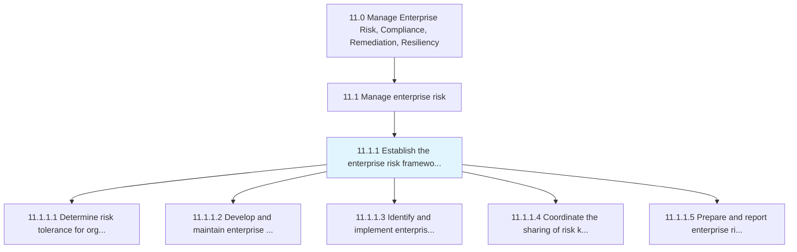
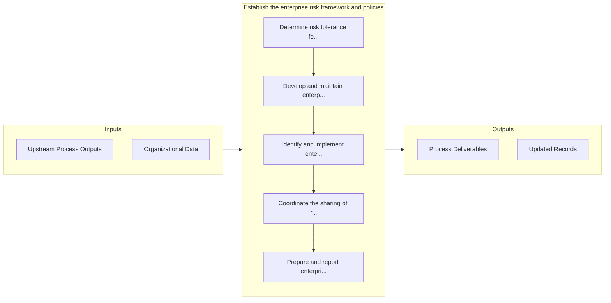

# Establish the enterprise risk framework and policies

> Creating an agenda for the rules and regulations of enterprise risk that deal with hazardous, financial, operational, and strategic risks.

## Overview

Process 11.1.1 is a core process that defines the specific procedures for establish the enterprise risk framework and policies. 

Creating an agenda for the rules and regulations of enterprise risk that deal with hazardous, financial, operational, and strategic risks.

## Process Hierarchy



## Key Statistics

| Metric | Value |
|--------|-------|
| APQC Code | 16439 |
| Hierarchy ID | 11.1.1 |
| Level | Process |
| Parent | [11.1](../) |
| Sub-Processes | 5 |


## GraphDL Semantic Structure

```
establish.TheEnterpriseRiskFrameworkAndPolicies
```

| Component | Value | Description |
|-----------|-------|-------------|
| Verb | `establish` | Primary action |
| Object | `the enterprise risk framework and policies` | Direct object |


## Process Flow



## Sub-Processes

| Process | Hierarchy ID | Description |
|---------|-------------|-------------|
| [Determine risk tolerance for organization](./DetermineRiskToleranceForOrganization) | 11.1.1.1 | Recognizing the organization's tolerance for risk, given risk-return trade-offs for one or more anti |
| [Develop and maintain enterprise risk policies and procedures](./DevelopAndMaintainEnterpriseRiskPoliciesAndProcedures) | 11.1.1.2 | Establishing and maintaining the policies and procedures for managing risk |
| [Identify and implement enterprise risk management tools](./IdentifyAndImplementEnterpriseRiskManagementTools) | 11.1.1.3 | Recognizing and implementing tools for managing risk |
| [Coordinate the sharing of risk knowledge across the organization](./CoordinateTheSharingOfRiskKnowledgeAcrossTheOrganization) | 11.1.1.4 | Communicating the knowledge about risk within the organization |
| [Prepare and report enterprise risk to executive management and board](./PrepareAndReportEnterpriseRiskToExecutiveManagementAndBoard) | 11.1.1.5 | Preparing and presenting reports about enterprise risk to the management of the organization |


## Related Concepts

- EnterpriseRiskFramework
- Policies


---

*Source: APQC PCF 16439 (11.1.1) - APQC*
