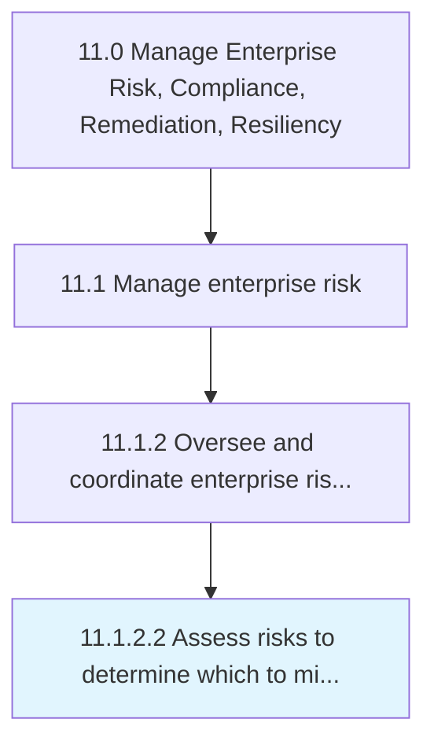

# Assess risks to determine which to mitigate

> Identifying options/actions to enhance opportunities and reduce threats.

## Overview

Activity 11.1.2.2 is an activity within the Manage Enterprise Risk, Compliance, Remediation, Resiliency framework. 

Identifying options/actions to enhance opportunities and reduce threats. Recognize the root reasons of the identified risks.

## Process Hierarchy



## Key Statistics

| Metric | Value |
|--------|-------|
| APQC Code | 16447 |
| Hierarchy ID | 11.1.2.2 |
| Level | Activity |
| Parent | [11.1.2](../) |
| Sub-Processes | 0 |


## GraphDL Semantic Structure

```
assess.Risks.to.DetermineWhichToMitigate
```

| Component | Value | Description |
|-----------|-------|-------------|
| Verb | `assess` | Primary action |
| Object | `risks` | Direct object |
| Preposition | `to` | Relationship |
| PrepObject | `determine which to mitigate` | Indirect object |


## Related Concepts

- Risks
- DetermineWhichToMitigate


---

*Source: APQC PCF 16447 (11.1.2.2) - APQC*
