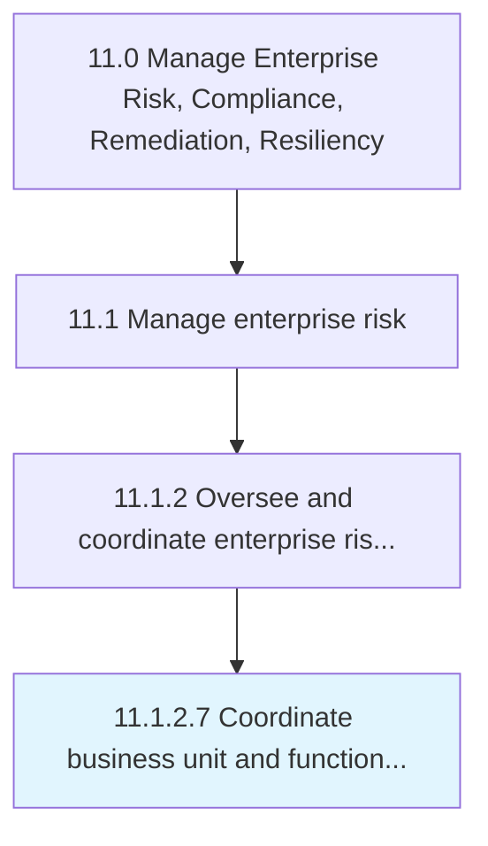

# Coordinate business unit and functional risk management activities

> Coordinating risk management activities to improve opportunities and lessen threats.

## Overview

Activity 11.1.2.7 is an activity within the Manage Enterprise Risk, Compliance, Remediation, Resiliency framework. 

Coordinating risk management activities to improve opportunities and lessen threats. Specify the organization's objectives. Assign resources to project objectives.

## Process Hierarchy



## Key Statistics

| Metric | Value |
|--------|-------|
| APQC Code | 16452 |
| Hierarchy ID | 11.1.2.7 |
| Level | Activity |
| Parent | [11.1.2](../) |
| Sub-Processes | 0 |


## GraphDL Semantic Structure

```
coordinate.BusinessUnitAndFunctionalRiskManagementActivities
```

| Component | Value | Description |
|-----------|-------|-------------|
| Verb | `coordinate` | Primary action |
| Object | `business unit and functional risk management activities` | Direct object |


## Related Concepts

- BusinessUnitRiskManagementActivities
- FunctionalRiskManagementActivities


---

*Source: APQC PCF 16452 (11.1.2.7) - APQC*
