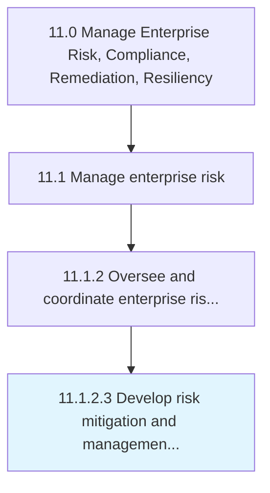

# Develop risk mitigation and management strategy and integrate with existing performance management processes

> Developing activities to improve opportunities and lessen threats.

## Overview

Activity 11.1.2.3 is an activity within the Manage Enterprise Risk, Compliance, Remediation, Resiliency framework. 

Developing activities to improve opportunities and lessen threats. Specify the organization's objectives. Evolve strategies and policies to attain these objectives. Assign resources to project objectives.

## Process Hierarchy



## Key Statistics

| Metric | Value |
|--------|-------|
| APQC Code | 16448 |
| Hierarchy ID | 11.1.2.3 |
| Level | Activity |
| Parent | [11.1.2](../) |
| Sub-Processes | 0 |


## GraphDL Semantic Structure

```
develop.RiskMitigationAndManagementStrategyAndIntegrate.with.ExistingPerformanceManagementProcesses
```

| Component | Value | Description |
|-----------|-------|-------------|
| Verb | `develop` | Primary action |
| Object | `risk mitigation and management strategy and integrate` | Direct object |
| Preposition | `with` | Relationship |
| PrepObject | `existing performance management processes` | Indirect object |


## Related Concepts

- [RiskMitigationStrategyIntegrate](/concepts/RiskMitigationStrategyIntegrate)
- [ExistingPerformanceManagementProcesses](/concepts/ExistingPerformanceManagementProcesses)
- [ManagementStrategyIntegrate](/concepts/ManagementStrategyIntegrate)
- [ExistingPerformanceManagementProcesses](/concepts/ExistingPerformanceManagementProcesses)


---

*Source: APQC PCF 16448 (11.1.2.3) - APQC*
