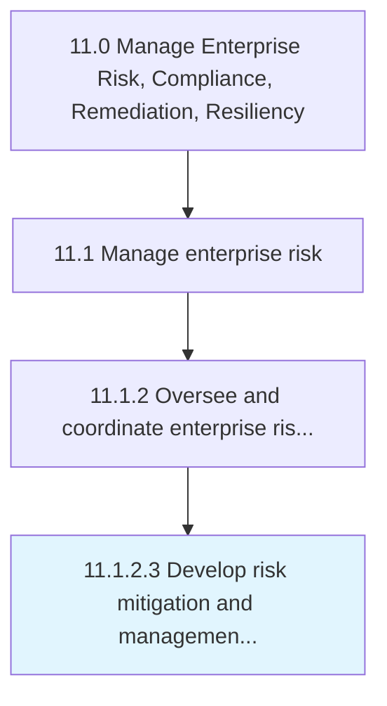
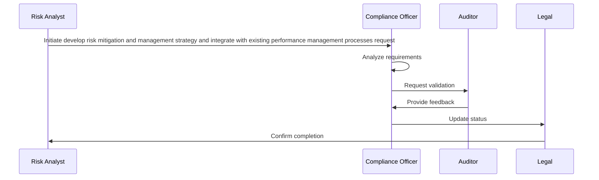

# Develop risk mitigation and management strategy and integrate with existing performance management processes

> Developing activities to improve opportunities and lessen threats.

## Overview

Activity 11.1.2.3 is an activity within the Manage Enterprise Risk, Compliance, Remediation, Resiliency framework. 

Developing activities to improve opportunities and lessen threats. Specify the organization's objectives. Evolve strategies and policies to attain these objectives. Assign resources to project objectives.

## Process Hierarchy



## Key Statistics

| Metric | Value |
|--------|-------|
| APQC Code | 16448 |
| Hierarchy ID | 11.1.2.3 |
| Level | Activity |
| Parent | [11.1.2](../) |
| Sub-Processes | 0 |


## Process Overview

Risk and compliance processes identify, assess, and manage enterprise risks and ensure regulatory compliance. This process focuses on develop risk mitigation and management strategy and integrate with existing performance management processes, which is essential for organizational effectiveness and achieving business objectives.

## Key Metrics

| Metric | Description | Target |
|--------|-------------|--------|
| Compliance rate | Measure of compliance rate | Target varies by organization |
| Risk incidents | Measure of risk incidents | Target varies by organization |
| Audit findings | Measure of audit findings | Target varies by organization |
| Control effectiveness | Measure of control effectiveness | Target varies by organization |

## Related Departments

- [Legal](/departments/Legal)
- [Compliance](/departments/Compliance)
- [Risk Management](/departments/Risk Management)

## Related Occupations

- [Compliance Managers](/occupations/Management/ComplianceManagers)
- [Risk Analysts](/occupations/Business/FinancialRiskSpecialists)
- [Internal Auditors](/occupations/Business/AccountantsAndAuditors)

## RACI Matrix

| Activity | Responsible | Accountable | Consulted | Informed |
|----------|-------------|-------------|-----------|----------|
| Plan | Process Owner | Manager | Stakeholders | Team |
| Execute | Team | Process Owner | Manager | Stakeholders |
| Monitor | Analyst | Manager | Process Owner | Leadership |
| Improve | Process Owner | Manager | Team | Stakeholders |

## GraphDL Semantic Structure

```graphdl
develop.RiskMitigationAndManagementStrategyAndIntegrate.with.ExistingPerformanceManagementProcesses
```

| Component | Value | Description |
|-----------|-------|-------------|
| Verb | `develop` | Primary action |
| Object | `risk mitigation and management strategy and integrate` | Direct object |
| Preposition | `with` | Relationship |
| PrepObject | `existing performance management processes` | Indirect object |


## Process Sequence


## Related Concepts

- RiskMitigationStrategyIntegrate
- ExistingPerformanceManagementProcesses
- ManagementStrategyIntegrate
- ExistingPerformanceManagementProcesses


---

*Source: APQC PCF 16448 (11.1.2.3) - APQC*
