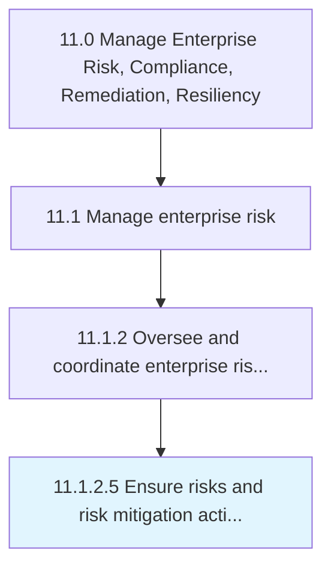

# Ensure risks and risk mitigation actions are monitored

> Ensuring risk monitoring and mitigation activities.

## Overview

Activity 11.1.2.5 is an activity within the Manage Enterprise Risk, Compliance, Remediation, Resiliency framework. 

Ensuring risk monitoring and mitigation activities. Monitor actions to enhance opportunities and reduce threats to project objectives.

## Process Hierarchy



## Key Statistics

| Metric | Value |
|--------|-------|
| APQC Code | 16450 |
| Hierarchy ID | 11.1.2.5 |
| Level | Activity |
| Parent | [11.1.2](../) |
| Sub-Processes | 0 |


## GraphDL Semantic Structure

```
ensure.RisksAndRiskMitigationActionsAreMonitored
```

| Component | Value | Description |
|-----------|-------|-------------|
| Verb | `ensure` | Primary action |
| Object | `risks and risk mitigation actions are monitored` | Direct object |


## Related Concepts

- RisksMitigationActionsAreMonitored
- RiskMitigationActionsAreMonitored


---

*Source: APQC PCF 16450 (11.1.2.5) - APQC*
