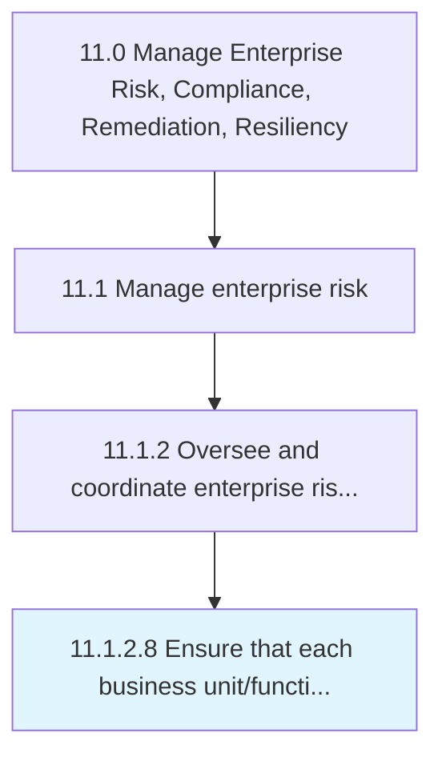
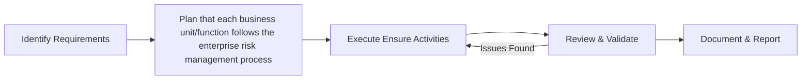

# Ensure that each business unit/function follows the enterprise risk management process

> Checking each business unit's/function's options and activities to improve opportunities and lessen threats.

## Overview

The ensure that each business unit/function follows the enterprise risk management process process is a critical component of the Enterprise Risk & Compliance function within an organization. It encompasses the systematic approach to ensure that each business unit/function follows the enterprise risk management process, ensuring that all activities are performed consistently, efficiently, and in alignment with organizational objectives. This process establishes the framework through which ensure that each business unit/function follows the enterprise risk management process is executed, monitored, and continuously improved to deliver value across the enterprise.

Within the APQC Process Classification Framework (hierarchy 11.1.2.8), this activity supports the broader "Manage Enterprise Risk, Compliance, Remediation, Resiliency" category. Effective execution requires cross-functional collaboration, clear accountability, and robust governance mechanisms. Organizations that mature this process typically see improved operational performance, reduced risk exposure, and stronger alignment between tactical activities and strategic goals.


## Process Hierarchy



## Key Statistics

| Metric | Value |
|--------|-------|
| APQC Code | 16453 |
| Hierarchy ID | 11.1.2.8 |
| Level | Activity |
| Parent | [11.1.2](../) |
| Sub-Processes | 0 |


## GraphDL Semantic Structure

```graphdl
ensure.ThatEachBusinessUnitfunctionFollowsTheEnterpriseRiskManagementProcess
```

| Component | Value | Description |
|-----------|-------|-------------|
| Verb | `ensure` | Primary action |
| Object | `that each business unit/function follows the enterprise risk management process` | Direct object |


## Process Flow



## RACI Matrix

| Activity | Officer | Manager | Analyst | Auditor |
|----------|------|------|------|------|
| Planning & Scoping | R | A | C | I |
| Execution | A | C | I | R |
| Review & Approval | C | I | R | A |
| Reporting | I | R | A | C |

## Related Occupations

- [Chief Risk Officer](/occupations/ChiefRiskOfficer)
- [Compliance Manager](/occupations/ComplianceManager)
- [Risk Analyst](/occupations/RiskAnalyst)
- [Internal Auditor](/occupations/InternalAuditor)

## Related Departments

- Risk Management
- Legal & Compliance
- Internal Audit

## Industry Variations

### Financial Services

Extensive regulatory frameworks (Basel III, Dodd-Frank), stress testing requirements, and real-time risk monitoring across trading and credit portfolios.

### Healthcare

HIPAA compliance, patient safety risk management, clinical trial oversight, and medical device regulatory tracking.

### Energy & Utilities

Environmental compliance (EPA, NERC), operational safety risk, pipeline integrity management, and disaster resilience planning.

## KPIs & Metrics

| KPI | Target | Measurement Frequency |
|-----|--------|----------------------|
| Risk Assessment Completion Rate | 100% | Quarterly |
| Compliance Violation Count | 0 | Monthly |
| Audit Finding Resolution Time | < 30 days | Per Finding |
| Risk Mitigation Plan Coverage | > 95% | Quarterly |

## Related Concepts

- BusinessUnitFollowsEnterpriseRiskManagementProcess
- BusinessFunctionFollowsEnterpriseRiskManagementProcess


---

*Source: APQC PCF 16453 (11.1.2.8) - APQC*
