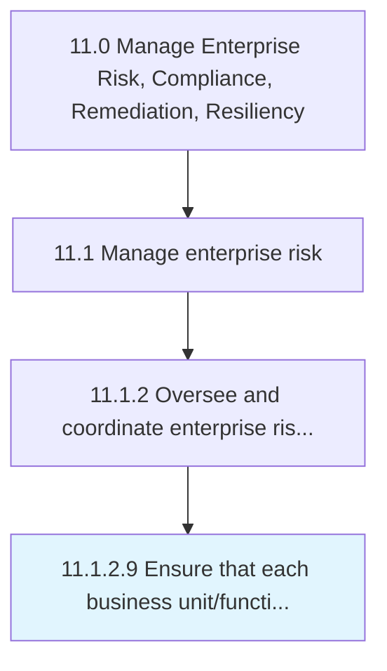

# Ensure that each business unit/function follows the enterprise risk reporting process

> Checking the reporting process of each business unit's/function's options and activities to improve opportunities and lessen threats.

## Overview

Activity 11.1.2.9 is an activity within the Manage Enterprise Risk, Compliance, Remediation, Resiliency framework. 

Checking the reporting process of each business unit's/function's options and activities to improve opportunities and lessen threats.

## Process Hierarchy



## Key Statistics

| Metric | Value |
|--------|-------|
| APQC Code | 16454 |
| Hierarchy ID | 11.1.2.9 |
| Level | Activity |
| Parent | [11.1.2](../) |
| Sub-Processes | 0 |


## GraphDL Semantic Structure

```
ensure.ThatEachBusinessUnitfunctionFollowsTheEnterpriseRiskReportingProcess
```

| Component | Value | Description |
|-----------|-------|-------------|
| Verb | `ensure` | Primary action |
| Object | `that each business unit/function follows the enterprise risk reporting process` | Direct object |


## Related Concepts

- [BusinessUnitFollowsEnterpriseRiskReportingProcess](/concepts/BusinessUnitFollowsEnterpriseRiskReportingProcess)
- [BusinessFunctionFollowsEnterpriseRiskReportingProcess](/concepts/BusinessFunctionFollowsEnterpriseRiskReportingProcess)


---

*Source: APQC PCF 16454 (11.1.2.9) - APQC*
