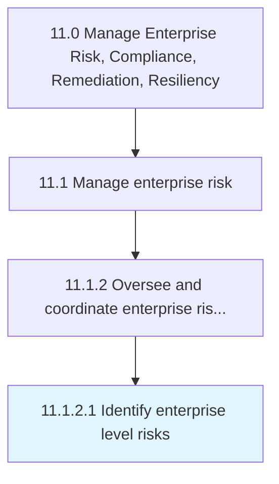

# Identify enterprise level risks

> Determining risks that could thwart objectives.

## Overview

Activity 11.1.2.1 is an activity within the Manage Enterprise Risk, Compliance, Remediation, Resiliency framework. 

Determining risks that could thwart objectives. Document and communicate the concern.

## Process Hierarchy



## Key Statistics

| Metric | Value |
|--------|-------|
| APQC Code | 16446 |
| Hierarchy ID | 11.1.2.1 |
| Level | Activity |
| Parent | [11.1.2](../) |
| Sub-Processes | 0 |


## GraphDL Semantic Structure

```
identify.EnterpriseLevelRisks
```

| Component | Value | Description |
|-----------|-------|-------------|
| Verb | `identify` | Primary action |
| Object | `enterprise level risks` | Direct object |


## Related Concepts

- EnterpriseLevelRisks


---

*Source: APQC PCF 16446 (11.1.2.1) - APQC*
