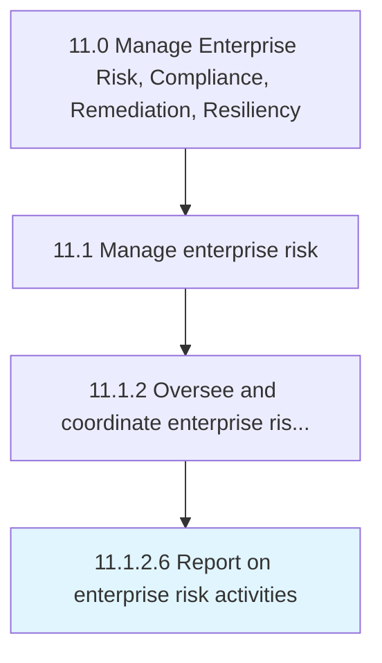

# Report on enterprise risk activities

> Creating a report of activities to address hazard risks, liability torts, financial risks, operational risks, social trends, competition, etc.

## Overview

Activity 11.1.2.6 is an activity within the Manage Enterprise Risk, Compliance, Remediation, Resiliency framework. 

Creating a report of activities to address hazard risks, liability torts, financial risks, operational risks, social trends, competition, etc.

## Process Hierarchy



## Key Statistics

| Metric | Value |
|--------|-------|
| APQC Code | 16451 |
| Hierarchy ID | 11.1.2.6 |
| Level | Activity |
| Parent | [11.1.2](../) |
| Sub-Processes | 0 |


## GraphDL Semantic Structure

```
report.OnEnterpriseRiskActivities
```

| Component | Value | Description |
|-----------|-------|-------------|
| Verb | `report` | Primary action |
| Object | `on enterprise risk activities` | Direct object |


## Related Concepts

- [EnterpriseRiskActivities](/concepts/EnterpriseRiskActivities)


---

*Source: APQC PCF 16451 (11.1.2.6) - APQC*
