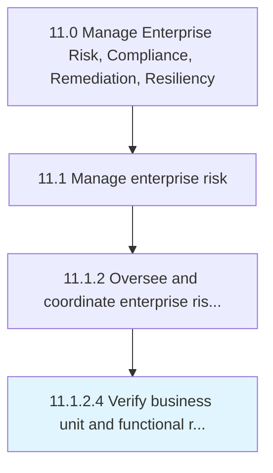

# Verify business unit and functional risk mitigation plans are implemented

> Checking that the blueprint created for managing risk in individual business units and divisions is correctly effectuated.

## Overview

Activity 11.1.2.4 is an activity within the Manage Enterprise Risk, Compliance, Remediation, Resiliency framework. 

Checking that the blueprint created for managing risk in individual business units and divisions is correctly effectuated. Validate the implementation of all activities geared to mitigate risks.

## Process Hierarchy



## Key Statistics

| Metric | Value |
|--------|-------|
| APQC Code | 16449 |
| Hierarchy ID | 11.1.2.4 |
| Level | Activity |
| Parent | [11.1.2](../) |
| Sub-Processes | 0 |


## GraphDL Semantic Structure

```
verify.BusinessUnitAndFunctionalRiskMitigationPlansAreImplemented
```

| Component | Value | Description |
|-----------|-------|-------------|
| Verb | `verify` | Primary action |
| Object | `business unit and functional risk mitigation plans are implemented` | Direct object |


## Related Concepts

- BusinessUnitRiskMitigationPlansAreImplemented
- FunctionalRiskMitigationPlansAreImplemented


---

*Source: APQC PCF 16449 (11.1.2.4) - APQC*
