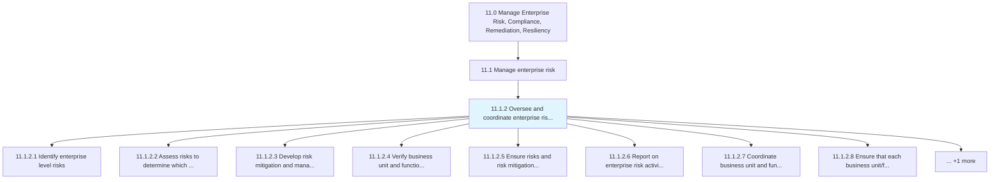
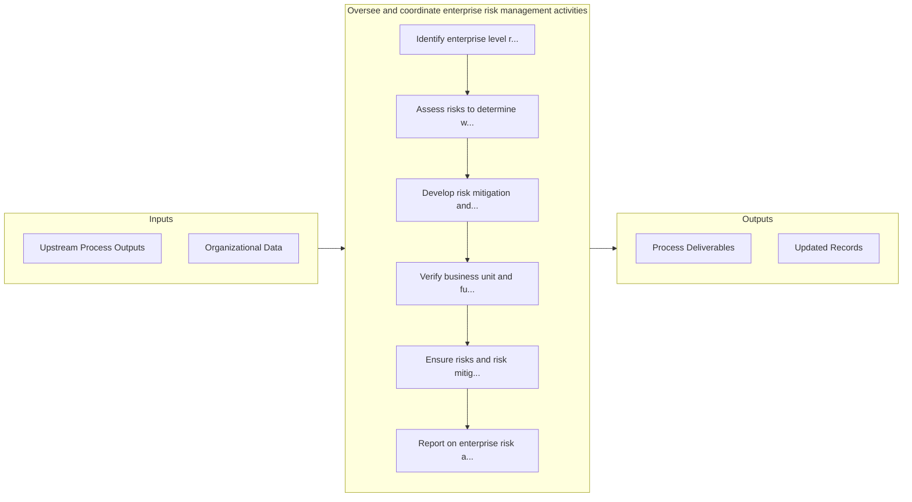

# Oversee and coordinate enterprise risk management activities

> Coordinating to plan, organize, lead, and control the activities of an organization in order to minimize the special effects of risk on capital and earnings.

## Overview

Process 11.1.2 is a core process that defines the specific procedures for oversee and coordinate enterprise risk management activities. 

Coordinating to plan, organize, lead, and control the activities of an organization in order to minimize the special effects of risk on capital and earnings.

## Process Hierarchy



## Key Statistics

| Metric | Value |
|--------|-------|
| APQC Code | 16445 |
| Hierarchy ID | 11.1.2 |
| Level | Process |
| Parent | [11.1](../) |
| Sub-Processes | 9 |


## GraphDL Semantic Structure

```
oversee.AndCoordinateEnterpriseRiskManagementActivities
```

| Component | Value | Description |
|-----------|-------|-------------|
| Verb | `oversee` | Primary action |
| Object | `and coordinate enterprise risk management activities` | Direct object |


## Process Flow



## Sub-Processes

| Process | Hierarchy ID | Description |
|---------|-------------|-------------|
| [Identify enterprise level risks](./IdentifyEnterpriseLevelRisks) | 11.1.2.1 | Determining risks that could thwart objectives |
| [Assess risks to determine which to mitigate](./AssessRisksToDetermineWhichToMitigate) | 11.1.2.2 | Identifying options/actions to enhance opportunities and reduce threats |
| [Develop risk mitigation and management strategy and integrate with existing performance management processes](./DevelopRiskMitigationAndManagementStrategyAndIntegrateWithExistingPerformanceManagementProcesses) | 11.1.2.3 | Developing activities to improve opportunities and lessen threats |
| [Verify business unit and functional risk mitigation plans are implemented](./VerifyBusinessUnitAndFunctionalRiskMitigationPlansAreImplemented) | 11.1.2.4 | Checking that the blueprint created for managing risk in individual business units and divisions is  |
| [Ensure risks and risk mitigation actions are monitored](./EnsureRisksAndRiskMitigationActionsAreMonitored) | 11.1.2.5 | Ensuring risk monitoring and mitigation activities |
| [Report on enterprise risk activities](./ReportOnEnterpriseRiskActivities) | 11.1.2.6 | Creating a report of activities to address hazard risks, liability torts, financial risks, operation |
| [Coordinate business unit and functional risk management activities](./CoordinateBusinessUnitAndFunctionalRiskManagementActivities) | 11.1.2.7 | Coordinating risk management activities to improve opportunities and lessen threats |
| [Ensure that each business unit/function follows the enterprise risk management process](./EnsureThatEachBusinessUnitfunctionFollowsTheEnterpriseRiskManagementProcess) | 11.1.2.8 | Checking each business unit's/function's options and activities to improve opportunities and lessen  |
| [Ensure that each business unit/function follows the enterprise risk reporting process](./EnsureThatEachBusinessUnitfunctionFollowsTheEnterpriseRiskReportingProcess) | 11.1.2.9 | Checking the reporting process of each business unit's/function's options and activities to improve  |


## Related Concepts

- EnterpriseRiskManagementActivities
- EnterpriseRiskManagementActivities


---

*Source: APQC PCF 16445 (11.1.2) - APQC*
