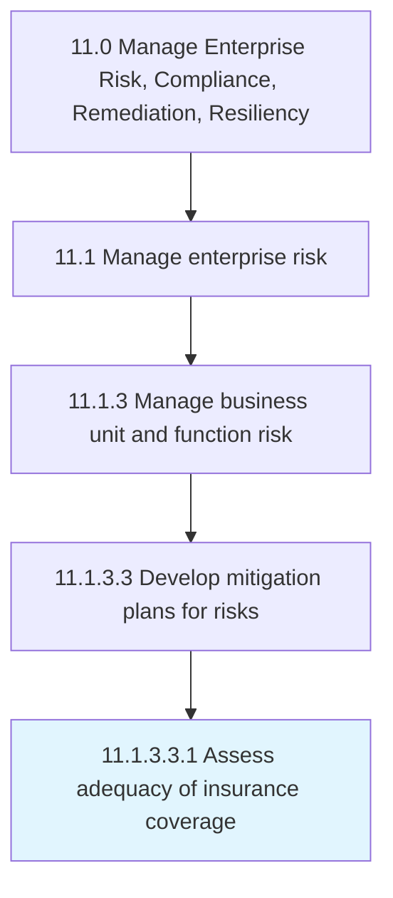

# Assess adequacy of insurance coverage

> Evaluating the changing needs for insurance coverage.

## Overview

Sub-Activity 11.1.3.3.1 is an activity within the Manage Enterprise Risk, Compliance, Remediation, Resiliency framework. 

Evaluating the changing needs for insurance coverage. Research available insurance providers and offerings.

## Process Hierarchy



## Key Statistics

| Metric | Value |
|--------|-------|
| APQC Code | 18129 |
| Hierarchy ID | 11.1.3.3.1 |
| Level | Sub-Activity |
| Parent | [11.1.3.3](../) |
| Sub-Processes | 0 |


## GraphDL Semantic Structure

```
assess.Adequacy.of.InsuranceCoverage
```

| Component | Value | Description |
|-----------|-------|-------------|
| Verb | `assess` | Primary action |
| Object | `adequacy` | Direct object |
| Preposition | `of` | Relationship |
| PrepObject | `insurance coverage` | Indirect object |


## Related Concepts

- [Adequacy](/concepts/Adequacy)
- [InsuranceCoverage](/concepts/InsuranceCoverage)


---

*Source: APQC PCF 18129 (11.1.3.3.1) - APQC*
