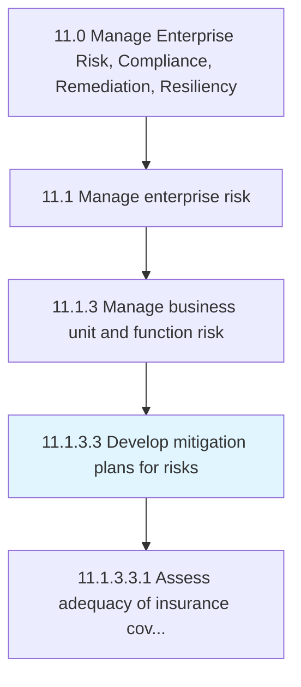
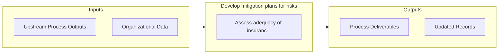

# Develop mitigation plans for risks

> Developing possibilities and arrangements to improve opportunities and reduce deviations to project objectives.

## Overview

Activity 11.1.3.3 is an activity within the Manage Enterprise Risk, Compliance, Remediation, Resiliency framework. 

Developing possibilities and arrangements to improve opportunities and reduce deviations to project objectives.

## Process Hierarchy



## Key Statistics

| Metric | Value |
|--------|-------|
| APQC Code | 16458 |
| Hierarchy ID | 11.1.3.3 |
| Level | Activity |
| Parent | [11.1.3](../) |
| Sub-Processes | 1 |


## GraphDL Semantic Structure

```graphdl
develop.MitigationPlans.for.Risks
```

| Component | Value | Description |
|-----------|-------|-------------|
| Verb | `develop` | Primary action |
| Object | `mitigation plans` | Direct object |
| Preposition | `for` | Relationship |
| PrepObject | `risks` | Indirect object |


## Process Flow



## Sub-Processes

| Process | Hierarchy ID | Description |
|---------|-------------|-------------|
| [Assess adequacy of insurance coverage](./AssessAdequacyOfInsuranceCoverage) | 11.1.3.3.1 | Evaluating the changing needs for insurance coverage |


## Related Concepts

- MitigationPlans
- Risks


---

*Source: APQC PCF 16458 (11.1.3.3) - APQC*
