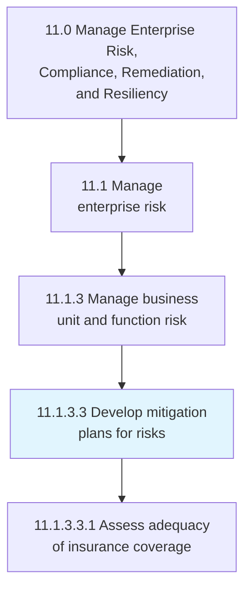
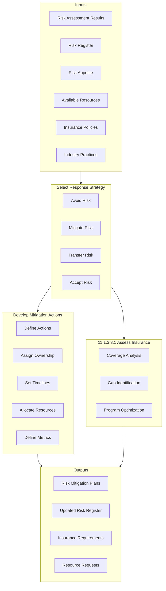
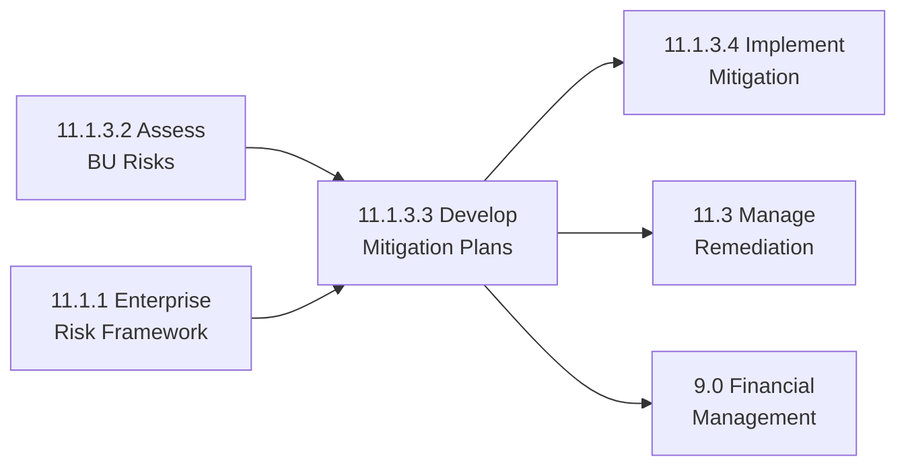

# Develop mitigation plans for risks

> Developing possibilities and arrangements to improve opportunities and reduce deviations to project objectives through structured risk response planning and insurance adequacy assessment.

## Overview

Activity 11.1.3.3 focuses on creating actionable plans to address identified risks at the business unit and function level. This includes selecting appropriate risk response strategies, developing detailed mitigation actions, assigning ownership, establishing timelines, and ensuring adequate risk transfer mechanisms through insurance.

Effective mitigation planning transforms risk assessments into concrete actions that reduce risk exposure to acceptable levels. This activity balances the cost and effort of mitigation against the potential impact of unmitigated risks, optimizing the organization's risk-return profile.

## Process Hierarchy



## Key Statistics

| Metric | Value |
|--------|-------|
| APQC Code | 16458 |
| Hierarchy ID | 11.1.3.3 |
| Level | Activity |
| Parent | [11.1.3 Manage business unit and function risk](../) |
| Process Group | [11.1 Manage enterprise risk](../../) |
| Sub-Processes | 1 |

## Process Flow



## GraphDL Semantic Structure

```graphdl
develop.MitigationPlans.for.Risks
```

| Component | Value | Description |
|-----------|-------|-------------|
| Verb | `develop` | Planning action |
| Object | `MitigationPlans` | Risk response plans |
| Preposition | `for` | Target relationship |
| PrepObject | `Risks` | Identified risks |

### Decomposed Actions

| Activity | GraphDL Structure |
|----------|-------------------|
| 11.1.3.3.1 | `assess.Adequacy.of.InsuranceCoverage` |

## Sub-Processes

### [11.1.3.3.1 Assess adequacy of insurance coverage](./AssessAdequacyOfInsuranceCoverage)

Evaluating the changing needs for insurance coverage to ensure appropriate risk transfer mechanisms are in place.

**Key Activities:**
- Review current insurance policies and coverage
- Identify coverage gaps against risk profile
- Analyze cost-benefit of additional coverage
- Recommend insurance program changes
- Coordinate with insurance brokers and carriers

## Risk Response Strategies

### Avoid
Eliminate the risk by removing the risk cause or changing project plans.

### Mitigate
Reduce the probability or impact of the risk through preventive actions.

### Transfer
Shift the risk to a third party through insurance, contracts, or outsourcing.

### Accept
Acknowledge the risk and prepare contingency plans without proactive mitigation.

## RACI Matrix

| Activity | Responsible | Accountable | Consulted | Informed |
|----------|-------------|-------------|-----------|----------|
| Select Response Strategy | BU Risk Manager | BU Leader | ERM, Legal | CRO |
| Develop Mitigation Actions | Risk Owners | BU Risk Manager | Subject Experts | ERM Team |
| Assess Insurance Coverage | Risk Manager | CFO/CRO | Broker, Legal | Finance, BU Leaders |

## Key Stakeholders

| Stakeholder | Role | Responsibilities |
|-------------|------|------------------|
| Business Unit Leader | Plan Approver | Mitigation plan approval |
| BU Risk Manager | Coordination | Plan development facilitation |
| Risk Owners | Execution | Mitigation action implementation |
| Chief Risk Officer | Oversight | Enterprise alignment |
| Insurance Broker | Advisory | Insurance market expertise |
| Legal Counsel | Review | Contractual risk transfer |

## Metrics and KPIs

| Metric | Description | Target |
|--------|-------------|--------|
| Mitigation Plan Coverage | High risks with mitigation plans | 100% |
| Plan Implementation Rate | Actions completed on schedule | >90% |
| Residual Risk Reduction | Post-mitigation risk level | Within appetite |
| Insurance Coverage Ratio | Insured vs. insurable exposure | >95% |
| Cost of Risk | Total risk management cost | Benchmark performance |
| Action Completion | Mitigation actions completed | >95% |

## Mitigation Plan Components

| Component | Description |
|-----------|-------------|
| Risk Description | Clear statement of the risk |
| Response Strategy | Avoid/Mitigate/Transfer/Accept |
| Mitigation Actions | Specific actions to be taken |
| Risk Owner | Individual accountable for the risk |
| Action Owners | Individuals responsible for actions |
| Timeline | Deadlines for action completion |
| Resources | Budget, people, tools required |
| Success Metrics | How effectiveness will be measured |
| Residual Risk | Expected risk level post-mitigation |

## Industry Variations

### Financial Services
Focus on quantitative risk reduction and capital optimization. Sophisticated risk transfer mechanisms.

### Healthcare
Clinical risk mitigation with patient safety focus. Professional liability insurance considerations.

### Manufacturing
Operational risk mitigation and business continuity. Property and liability insurance programs.

### Technology
Cybersecurity risk mitigation and data breach insurance. Rapid threat evolution requires adaptive approaches.

## Related Processes



## Related Departments

- [Enterprise Risk Management](/departments/Risk) - Framework alignment
- [Finance](/departments/Finance) - Budget allocation
- [Legal](/departments/Legal) - Contractual risk transfer
- [Insurance/Treasury](/departments/Finance/Treasury) - Insurance programs
- [Business Units](/departments/Operations) - Execution

## Related Occupations

- [Risk Managers](/occupations/Business/Operations/RiskManagers) - Mitigation planning
- [Insurance Underwriters](/occupations/Business/Financial/InsuranceUnderwriters) - Coverage analysis
- [Financial Analysts](/occupations/Business/Financial/FinancialAnalysts) - Cost-benefit analysis
- [Compliance Officers](/occupations/Business/Operations/ComplianceOfficers) - Regulatory alignment

## Related Concepts

- RiskMitigation
- RiskResponse
- InsuranceManagement
- RiskTransfer
- ControlDesign
- ResidualRisk

---

*Source: APQC PCF 16458 (11.1.3.3) - Cross-Industry Process Classification Framework*
