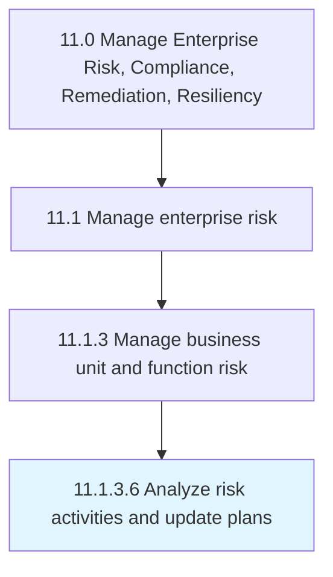

# Analyze risk activities and update plans

> Examining the impact of risk activities in order to update the existing scheme of risk management.

## Overview

Activity 11.1.3.6 is an activity within the Manage Enterprise Risk, Compliance, Remediation, Resiliency framework. 

Examining the impact of risk activities in order to update the existing scheme of risk management. Analyze and substantiate the potential for adverse consequences to occur. Consider the risks associated with the activity and the methods available to manage those risks.

## Process Hierarchy



## Key Statistics

| Metric | Value |
|--------|-------|
| APQC Code | 16461 |
| Hierarchy ID | 11.1.3.6 |
| Level | Activity |
| Parent | [11.1.3](../) |
| Sub-Processes | 0 |


## GraphDL Semantic Structure

```
analyze.RiskActivitiesAndUpdatePlans
```

| Component | Value | Description |
|-----------|-------|-------------|
| Verb | `analyze` | Primary action |
| Object | `risk activities and update plans` | Direct object |


## Related Concepts

- RiskActivities
- UpdatePlans


---

*Source: APQC PCF 16461 (11.1.3.6) - APQC*
