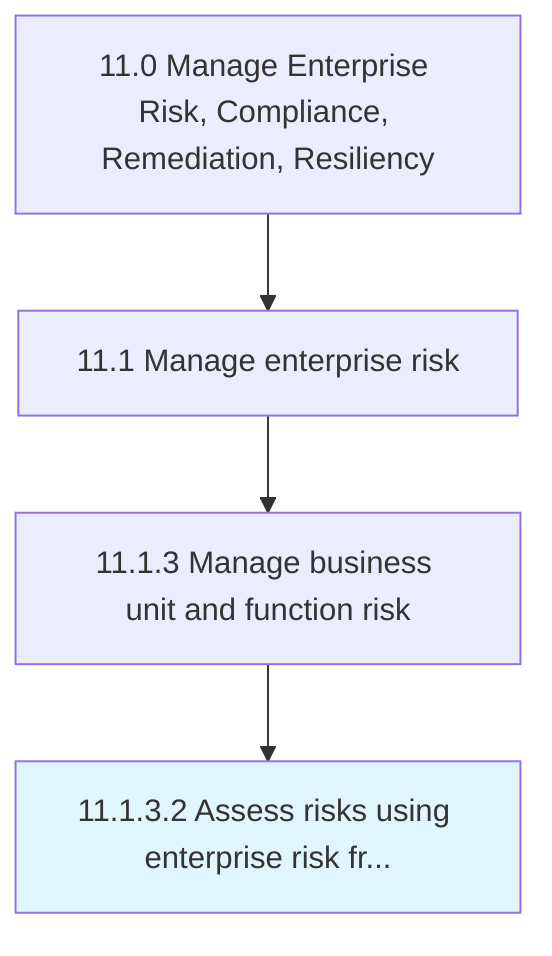

# Assess risks using enterprise risk framework policies and procedures

> Determining the possibility that a specified undesirable event will occur using established tools, implements, and frameworks.

## Overview

Activity 11.1.3.2 is an activity within the Manage Enterprise Risk, Compliance, Remediation, Resiliency framework. 

Determining the possibility that a specified undesirable event will occur using established tools, implements, and frameworks. Use risk assessments to determine, for example, whether to undertake a particular venture, what rate of return a particular investment requires, and how to mitigate an activity's potential losses.

## Process Hierarchy



## Key Statistics

| Metric | Value |
|--------|-------|
| APQC Code | 16457 |
| Hierarchy ID | 11.1.3.2 |
| Level | Activity |
| Parent | [11.1.3](../) |
| Sub-Processes | 0 |


## GraphDL Semantic Structure

```
assess.RisksUsingEnterpriseRiskFrameworkPoliciesAndProcedures
```

| Component | Value | Description |
|-----------|-------|-------------|
| Verb | `assess` | Primary action |
| Object | `risks using enterprise risk framework policies and procedures` | Direct object |


## Related Concepts

- RisksUsingEnterpriseRiskFrameworkPolicies
- Procedures


---

*Source: APQC PCF 16457 (11.1.3.2) - APQC*
