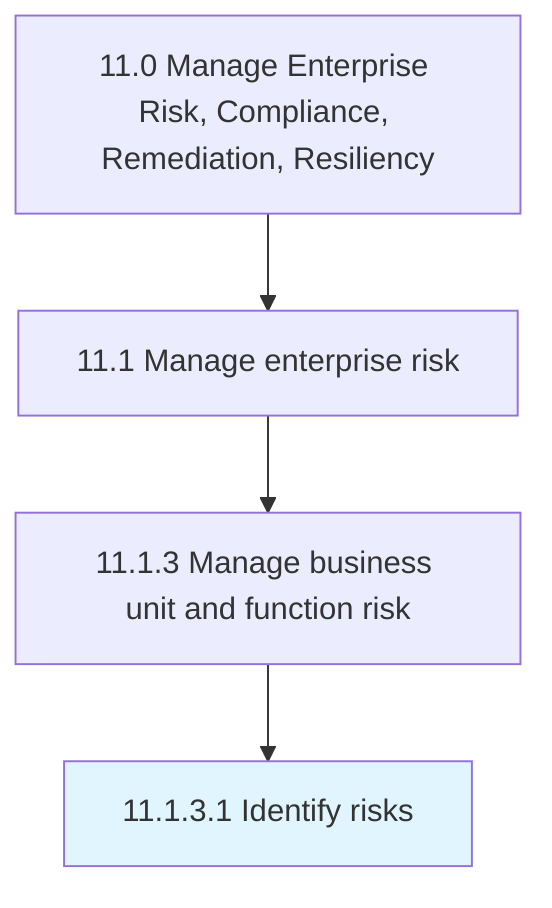

# Identify risks

> Developing a timely and continuous process to identify activities that might hinder a project's goals.

## Overview

Activity 11.1.3.1 is an activity within the Manage Enterprise Risk, Compliance, Remediation, Resiliency framework. 

Developing a timely and continuous process to identify activities that might hinder a project's goals.

## Process Hierarchy



## Key Statistics

| Metric | Value |
|--------|-------|
| APQC Code | 16456 |
| Hierarchy ID | 11.1.3.1 |
| Level | Activity |
| Parent | [11.1.3](../) |
| Sub-Processes | 0 |


## GraphDL Semantic Structure

```
identify.Risks
```

| Component | Value | Description |
|-----------|-------|-------------|
| Verb | `identify` | Primary action |
| Object | `risks` | Direct object |


## Related Concepts

- Risks


---

*Source: APQC PCF 16456 (11.1.3.1) - APQC*
