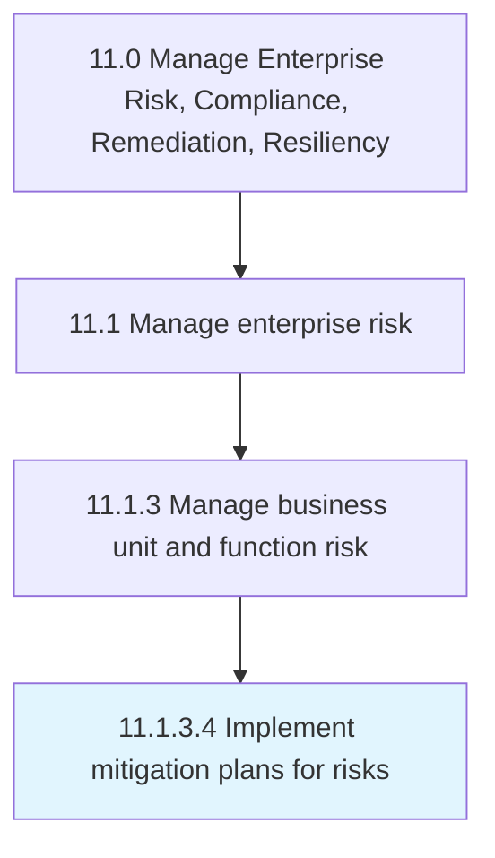

# Implement mitigation plans for risks

> Executing mitigation plans to improve opportunities and reduce deviations to project objectives.

## Overview

Activity 11.1.3.4 is an activity within the Manage Enterprise Risk, Compliance, Remediation, Resiliency framework. 

Executing mitigation plans to improve opportunities and reduce deviations to project objectives.

## Process Hierarchy



## Key Statistics

| Metric | Value |
|--------|-------|
| APQC Code | 16459 |
| Hierarchy ID | 11.1.3.4 |
| Level | Activity |
| Parent | [11.1.3](../) |
| Sub-Processes | 0 |


## GraphDL Semantic Structure

```
implement.MitigationPlans.for.Risks
```

| Component | Value | Description |
|-----------|-------|-------------|
| Verb | `implement` | Primary action |
| Object | `mitigation plans` | Direct object |
| Preposition | `for` | Relationship |
| PrepObject | `risks` | Indirect object |


## Related Concepts

- [MitigationPlans](/concepts/MitigationPlans)
- [Risks](/concepts/Risks)


---

*Source: APQC PCF 16459 (11.1.3.4) - APQC*
