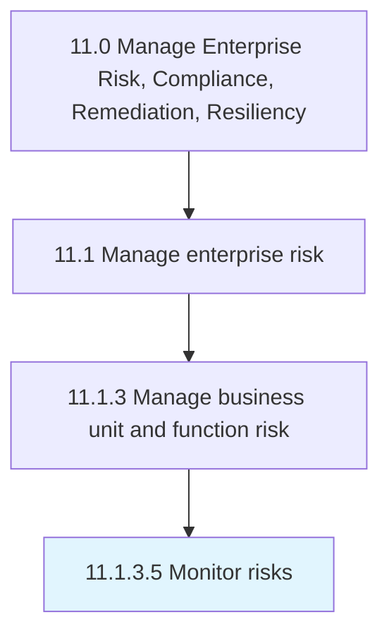

# Monitor risks

> Identifying, examining, and recognizing/justifying any improbability in investment decision making.

## Overview

Activity 11.1.3.5 is an activity within the Manage Enterprise Risk, Compliance, Remediation, Resiliency framework. 

Identifying, examining, and recognizing/justifying any improbability in investment decision making.

## Process Hierarchy



## Key Statistics

| Metric | Value |
|--------|-------|
| APQC Code | 16460 |
| Hierarchy ID | 11.1.3.5 |
| Level | Activity |
| Parent | [11.1.3](../) |
| Sub-Processes | 0 |


## GraphDL Semantic Structure

```
monitor.Risks
```

| Component | Value | Description |
|-----------|-------|-------------|
| Verb | `monitor` | Primary action |
| Object | `risks` | Direct object |


## Related Concepts

- [Risks](/concepts/Risks)


---

*Source: APQC PCF 16460 (11.1.3.5) - APQC*
